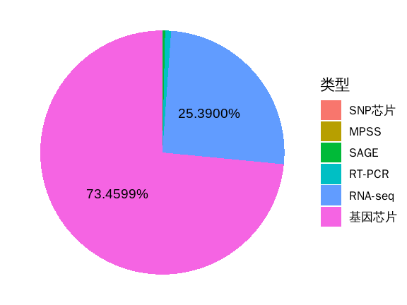
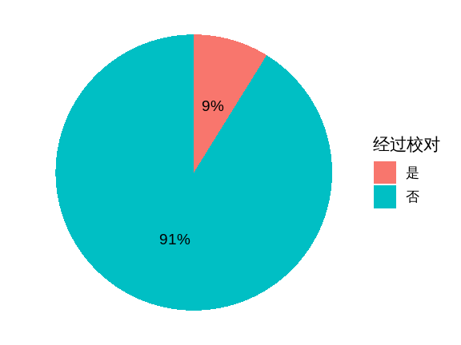
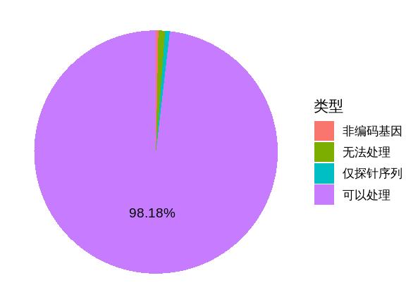
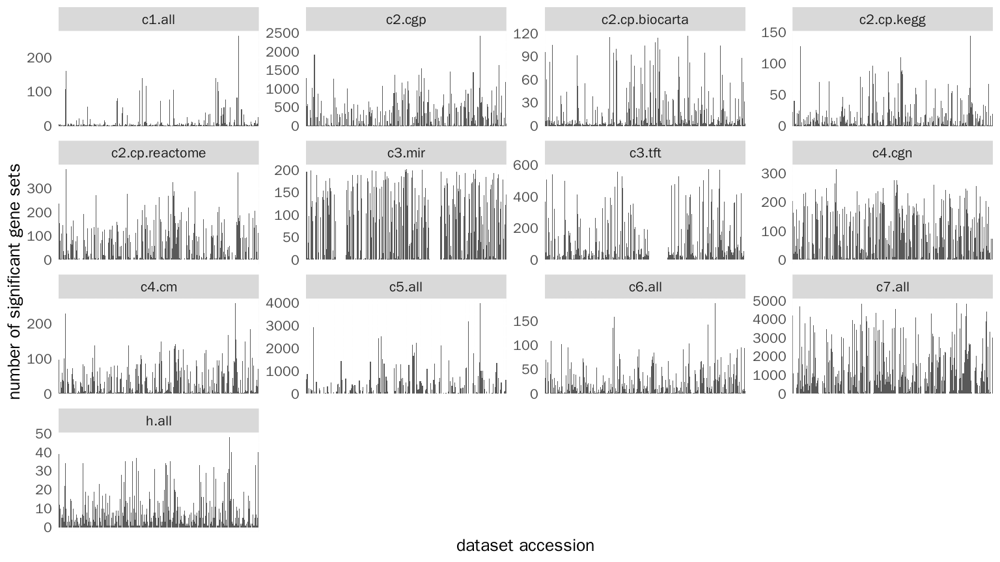
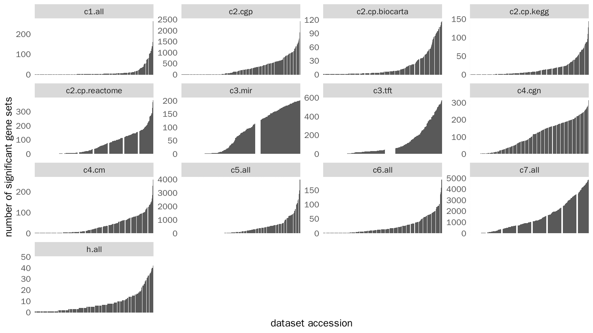
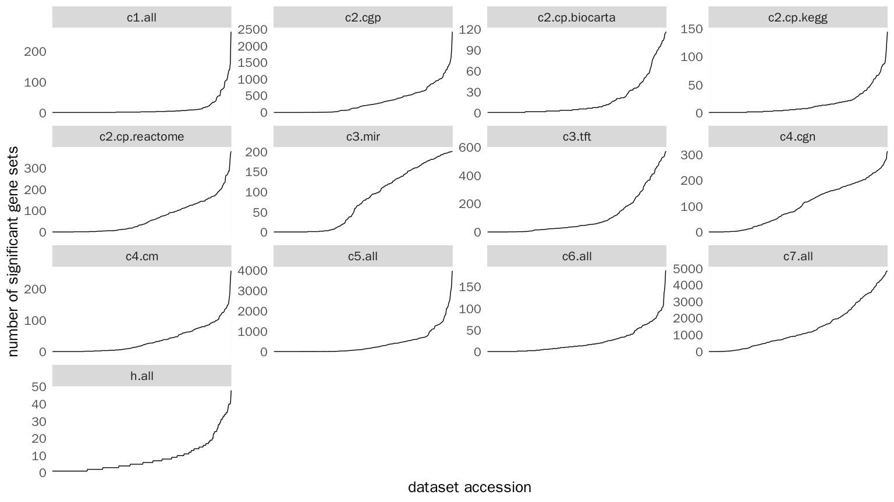

-   [preparation](#preparation)
-   [PPT](#ppt)
    -   [GEO数据库现状](#geo数据库现状)
    -   [严格人工校对的数据集仅占不到
        1/10](#严格人工校对的数据集仅占不到-110)
    -   [many slides](#many-slides)
    -   [将其他数据库中基因的ID对应到HUGO符号](#将其他数据库中基因的id对应到hugo符号)
    -   [上述工具 的成效](#上述工具-的成效)
    -   [four single dataset result](#four-single-dataset-result)
    -   [基因集重叠导致的假阳性](#基因集重叠导致的假阳性)
-   [scripts generating data used in
    Word](#scripts-generating-data-used-in-word)
    -   [图 4: rGEO的表现](#图-4-rgeo的表现)
    -   [图 6:
        各个集合在不同数据集中的整体表现](#图-6-各个集合在不同数据集中的整体表现)

<h1 align="center">
毕业论文 Figures
</h1>
<p align="center">
Zhuoer Dong
</p>
<p align="center">
2019-03-31
</p>

------------------------------------------------------------------------

[source
code](https://github.com/dongzhuoer/thesis/blob/master/figure.Rmd) –\|–
[correct
output](https://github.com/dongzhuoer/thesis/blob/master/figure.md)
(minor revision on 2019-12-27) –\|– [latest
output](https://latest-output.dongzhuoer.com/thesis/figure.html)

``` r
## install needed R packages
remotes::update_packages(c("magrittr", "dplyr", "ggplot2", "stringr", "WriteXLS"), upgrade = TRUE)
remotes::install_github(c("dongzhuoer/qGSEA", "dongzhuoer/rGEO"), upgrade = TRUE)
```

Refer to
[here](https://github.com/dongzhuoer/thesis/blob/master/readme.md#figures)
to reproduce this work.

preparation
===========

``` r
library(magrittr)
library(dplyr)
library(ggplot2)
library(stringr)
```

Set global theme for ggplot

``` r
theme_set(theme_void(16, "WenQuanYi Zen Hei"))
theme_update(legend.key.size = unit(8, 'mm'))
```

helper function

``` r
#' @param text_data passed on to geom_text()
pie_plot <- function(df, text_data = . %>% {.}) {
    df %>% mutate(percent = n/sum(n), label = scales::percent(percent)) %>%
        mutate(type = factor(type, levels = rev(type))) %>%
        ggplot() + geom_col(aes('', percent, fill = type), width = 1) +
        geom_text(aes(1, cumsum(percent) - percent/2, label = label), 
                  data = . %>% filter(percent > 0.05), size = 5) + 
        coord_polar(theta = "y", direction = -1)
}
```

PPT
===

GEO数据库现状
-------------

Go to
<a href="https://www.ncbi.nlm.nih.gov/geo/summary/?type=series" class="uri">https://www.ncbi.nlm.nih.gov/geo/summary/?type=series</a>,
following is a snapshot on 2018-05-30.

    Expression profiling by array   54,135
    Expression profiling by genome tiling array 730
    Expression profiling by high throughput sequencing  18,963
    Expression profiling by SAGE    238
    Expression profiling by MPSS    20
    Expression profiling by RT-PCR  587
    Expression profiling by SNP array   14

``` r
expression_profile <- tribble(
    ~type, ~n,
    '基因芯片', 54135 + 730,
    'RNA-seq', 18963,
    'SAGE', 238, 
    'MPSS', 20, 
    'RT-PCR', 587, 
    'SNP芯片', 14
)

expression_profile
#> # A tibble: 6 x 2
#>   type         n
#>   <chr>    <dbl>
#> 1 基因芯片 54865
#> 2 RNA-seq  18963
#> 3 SAGE       238
#> 4 MPSS        20
#> 5 RT-PCR     587
#> 6 SNP芯片     14
```

``` r
expression_profile %>% arrange(desc(n)) %>% 
    pie_plot + guides(fill = guide_legend(title = '类型'))
```



严格人工校对的数据集仅占不到 1/10
---------------------------------

Consult me for how to get `gds_result.txt`. Here I show the cached
output on 2018-05-22.

``` r
geo_all <- rGEO.data::read_summary(system.file('extdata/gds_result.txt', package = 'rGEO.data'))

geo_all %>% filter(str_detect(accession, 'GDS')) %>% nrow
#> [1] 1772

# super GSE contains multiple GSE's, I filter only 1 GPL to drop them to avoid repetition
geo_all %>% filter(str_detect(accession, 'GSE')) %>% filter(str_count(platform, 'GPL') == 1) %>% nrow
#> [1] 18309
```

``` r
tribble(
    ~type, ~n,
    '是', 1772,
    '否', 18309
) %>% arrange(desc(n)) %>% 
    pie_plot + guides(fill = guide_legend(title = '经过校对'))
```



many slides
-----------

Open `data-raw/geo-example.xlsx` and take screenshots.

将其他数据库中基因的ID对应到HUGO符号
------------------------------------

``` r
ensembl_df_to_symbol_df <- 
    . %>% dplyr::mutate('symbol' = hgnc::as_symbol_from_ensembl(!!rlang::sym('Ensembl'))) %>% dplyr::select(-Ensembl)

soft_df <- system.file('extdata/GSE19161_family.soft.gz', package = 'rGEO') %>% 
    {rGEO:::parse_gse_soft(., F)$table} %>% dplyr::select(ID, Ensembl) %>% 
    dplyr::slice(c(1, 2, 446, 3, 231, 4))
soft_df
#> # A tibble: 6 x 2
#>   ID          Ensembl                            
#>   <chr>       <chr>                              
#> 1 121_at      ENSG00000125618                    
#> 2 200003_s_at ENSG00000108107                    
#> 3 209919_x_at ENSG00000100031 /// ENSG00000100121
#> 4 200004_at   ENSG00000110321                    
#> 5 204060_s_at ENSG00000099725 /// ENSG00000183943
#> 6 200006_at   ENSG00000116288

(soft_df_single   <- soft_df %>% filter(!str_detect(Ensembl, '///')))
#> # A tibble: 4 x 2
#>   ID          Ensembl        
#>   <chr>       <chr>          
#> 1 121_at      ENSG00000125618
#> 2 200003_s_at ENSG00000108107
#> 3 200004_at   ENSG00000110321
#> 4 200006_at   ENSG00000116288
(soft_df_multiple <- soft_df %>% filter( str_detect(Ensembl, '///')))
#> # A tibble: 2 x 2
#>   ID          Ensembl                            
#>   <chr>       <chr>                              
#> 1 209919_x_at ENSG00000100031 /// ENSG00000100121
#> 2 204060_s_at ENSG00000099725 /// ENSG00000183943

(soft_df_melt1 <- soft_df_multiple %>% slice(1) %>% hgnc::melt_map('ID', 'Ensembl', '[^\\w]+'))
#> # A tibble: 2 x 2
#>   ID          Ensembl        
#>   <chr>       <chr>          
#> 1 209919_x_at ENSG00000100031
#> 2 209919_x_at ENSG00000100121
(soft_df_melt2 <- soft_df_multiple %>% slice(2) %>% hgnc::melt_map('ID', 'Ensembl', '[^\\w]+'))
#> # A tibble: 2 x 2
#>   ID          Ensembl        
#>   <chr>       <chr>          
#> 1 204060_s_at ENSG00000099725
#> 2 204060_s_at ENSG00000183943

(chip_df_melt1 <- soft_df_melt1 %>% ensembl_df_to_symbol_df())
#> # A tibble: 2 x 2
#>   ID          symbol
#>   <chr>       <chr> 
#> 1 209919_x_at GGT1  
#> 2 209919_x_at GGTLC2
(chip_df_melt2 <- soft_df_melt2 %>% ensembl_df_to_symbol_df())
#> # A tibble: 2 x 2
#>   ID          symbol
#>   <chr>       <chr> 
#> 1 204060_s_at PRKY  
#> 2 204060_s_at PRKX

(chip_df_cast1 <- chip_df_melt1 %>% hgnc::cast_map('ID', 'symbol'))
#> # A tibble: 1 x 2
#>   ID          symbol         
#>   <chr>       <chr>          
#> 1 209919_x_at GGT1 /// GGTLC2
(chip_df_cast2 <- chip_df_melt2 %>% hgnc::cast_map('ID', 'symbol'))
#> # A tibble: 1 x 2
#>   ID          symbol       
#>   <chr>       <chr>        
#> 1 204060_s_at PRKY /// PRKX

(chip_df_single <- soft_df_single %>% ensembl_df_to_symbol_df())
#> # A tibble: 4 x 2
#>   ID          symbol
#>   <chr>       <chr> 
#> 1 121_at      PAX8  
#> 2 200003_s_at RPL28 
#> 3 200004_at   EIF4G2
#> 4 200006_at   PARK7
(chip_df_multiple <- bind_rows(chip_df_cast1, chip_df_cast2))
#> # A tibble: 2 x 2
#>   ID          symbol         
#>   <chr>       <chr>          
#> 1 209919_x_at GGT1 /// GGTLC2
#> 2 204060_s_at PRKY /// PRKX

chip_df <- soft_df %>% hgnc::melt_map('ID', 'Ensembl', '[^ENSG\\d]+') %>%
    ensembl_df_to_symbol_df %>% hgnc::cast_map('ID', 'symbol') %>% 
    dplyr::select('Probe Set ID' = 1, 'Gene Symbol' = 2) %>% slice(c(1, 2, 6, 3, 5, 4))
chip_df
#> # A tibble: 6 x 2
#>   `Probe Set ID` `Gene Symbol`  
#>   <chr>          <chr>          
#> 1 121_at         PAX8           
#> 2 200003_s_at    RPL28          
#> 3 209919_x_at    GGT1 /// GGTLC2
#> 4 200004_at      EIF4G2         
#> 5 204060_s_at    PRKY /// PRKX  
#> 6 200006_at      PARK7
```

``` r
# NOT run
list(
    soft_df, 
    bind_rows(soft_df_single, soft_df_multiple), 
    bind_rows(soft_df_melt1, soft_df_melt2), 
    bind_rows(chip_df_melt1, chip_df_melt2), 
    bind_rows(chip_df_single, chip_df_multiple), 
    chip_df
) %>% WriteXLS::WriteXLS(
    'data-raw/mapping-probe-to-symbol.xlsx', 
    c('soft', 'soft split', 'soft melt', 'chip melt', 'chip split', 'chip')
)
```

Then open `data-raw/mapping-probe-to-symbol.xlsx` and take screenshots.

上述工具 [1] 的成效
-------------------

Here I use cached result on 2018-05-22.

``` r
tribble(
  ~type,   ~n,    
  "可以处理", 17753L,
  "仅探针序列", 113L,  
  "无法处理", 160L,  
  "非编码基因", 57L
) %>% pie_plot + guides(fill = guide_legend(title = '类型')) 
```



four single dataset result
--------------------------

``` r
# NOT run
gsea_output_full %>% filter(n_sample >= 100) %>% filter(FDR < 0.25) %>% 
    count(accession) %>% filter(n == 5 | n ==6)

gsea_output_full %>% filter(FDR < 0.25) %>% 
    filter(accession %in% c('GSE23177', 'GSE49577', 'GSE65212', 'GSE83591')) %>% 
    arrange(accession) %>% 
    mutate(collection = str_remove(collection, '.all$'), FDR = formatC(FDR, 2, format = 'f')) %>%
    select(accession, '集合' = collection, '基因集' = gene_set, FDR) %>% 
    WriteXLS::WriteXLS('data-raw/4-dataset-inconsistent.xlsx')
```

Then open `data-raw/4-dataset-inconsistent.xlsx` and take screenshots.

基因集重叠导致的假阳性
----------------------

Open following links and take screenshots:

-   <a href="http://software.broadinstitute.org/gsea/msigdb/compute_overlaps.jsp?geneSetName=HALLMARK_MTORC1_SIGNALING&amp;collection=H" class="uri">http://software.broadinstitute.org/gsea/msigdb/compute_overlaps.jsp?geneSetName=HALLMARK_MTORC1_SIGNALING&amp;collection=H</a>
-   <a href="http://software.broadinstitute.org/gsea/msigdb/compute_overlaps.jsp?geneSetName=HALLMARK_DNA_REPAIR&amp;collection=H" class="uri">http://software.broadinstitute.org/gsea/msigdb/compute_overlaps.jsp?geneSetName=HALLMARK_DNA_REPAIR&amp;collection=H</a>
-   <a href="http://software.broadinstitute.org/gsea/msigdb/compute_overlaps.jsp?geneSetName=HALLMARK_UNFOLDED_PROTEIN_RESPONSE&amp;collection=H" class="uri">http://software.broadinstitute.org/gsea/msigdb/compute_overlaps.jsp?geneSetName=HALLMARK_UNFOLDED_PROTEIN_RESPONSE&amp;collection=H</a>

scripts generating data used in Word
====================================

[图 4](https://bookdown.dongzhuoer.com/zhuoer/thesis/result.html#fig:rGEO-performance): rGEO的表现
--------------------------------------------------------------------------------------------------

Again, consult me for how to get `gds_result.txt`.

All accession in `lem4::platform_human` are downloaded into
`data-raw/GPL-html/`, so `gpls` and thus `qGSEA::gpl` both include
following subset of the whole geo, since lem4 ensure that
`lem4::platform_human` includes it.

``` r
# NOT run
geo <- rGEO.data::read_summary(system.file('extdata/gds_result.txt', package = 'rGEO.data'))

qGSEA_label <- tribble(
    ~old_type, ~type,
    'known', '可以处理',
    'sequence', '仅探针序列', 
    'unknown', '无法处理',
    'non-coding', '非编码基因'
) %T>% print

sum_to_qualify_qGSEA <- . %>% filter(type != 'non_human') %>%
    mutate(type = ifelse(type %in% c('circRNA', 'miRNA'), 'non-coding', type)) %>% 
    mutate(type = ifelse(type %in% c('unknown', 'non-coding', 'sequence'), type, 'known')) %>% 
    group_by(type) %>% summarise(n = sum(n)) %>% ungroup() %>% 
    left_join(qGSEA_label, ., by = c('old_type' = 'type')) %>% 
    select(-old_type)
rGEO.data::gpl_metas[1:6] %>% count(type) %>% ungroup() %>% sum_to_qualify_qGSEA() %T>% print

types <- rGEO.data::platform$Accession %>% parallel::mclapply(rGEO:::fake_platform, rGEO.data::gpl_metas) %>% parallel::mclapply(rGEO::guess_platform_type)
types %>% lapply(is.null) %>% unlist() %>% {!.} %>% sum
rGEO
gpl_sum <- qGSEA::gpl %>% count(type) %>% ungroup() %>% sum_to_qualify_qGSEA() %T>% print
#> # A tibble: 4 x 3
#>   old_type   type           n
#>   <chr>      <chr>      <int>
#> 1 known      可以处理    2626
#> 2 sequence   仅探针序列   986
#> 3 unknown    无法处理     783
#> 4 non-coding 非编码基因   473

gse_sum <- geo %>% filter(species == 'Homo sapiens', str_detect(accession, 'GSE')) %>% 
    filter(str_count(platform, 'GPL') == 1L) %>% 
    transmute(accession = str_extract(platform, 'GPL\\d+')) %>% count(accession) %>% 
    left_join(qGSEA::gpl) %>% group_by(type) %>% summarise(n = sum(n)) %>% ungroup() %>% 
    sum_to_qualify_qGSEA() %T>% print
#> # A tibble: 4 x 2
#>   type           n
#>   <chr>      <int>
#> 1 可以处理   17753
#> 2 仅探针序列   113
#> 3 无法处理     160
#> 4 非编码基因    57
```

[图 6](https://bookdown.dongzhuoer.com/zhuoer/thesis/result.html#fig:significant-geneset-per-dataset): 各个集合在不同数据集中的整体表现
---------------------------------------------------------------------------------------------------------------------------------------

Let’s see how to get the plot, I will show it step by step because the
final plot is not so straight-forward.

From now on, we refer to FDR \< 0.25 as “significant”.

``` r
# NOT run
sample_df <- readr::read_rds('data/breast_cancer.rds') %>% 
    filter(str_detect(accession, 'GSE')) %>%
    select(accession, n_sample = sample) %T>% print
#> # A tibble: 1,193 x 2
#>    accession n_sample
#>    <chr>        <int>
#>  1 GSE114359        6
#>  2 GSE106549        4
#> ...

significant_per_dataset <- readr::read_rds('data/gsea_output_full.rds') %>% 
    rename(gene_set = NAME, p = 'NOM p-val', FDR = 'FDR q-val') %>% filter(FDR < 0.25) %>% 
    group_by(collection, accession) %>% summarise(n = n()) %>%
    left_join(sample_df) %>% filter(n_sample >= 7) %>% arrange(desc(n)) %T>% 
    print %T>% write_rds('data/significant_per_dataset.rds')
#> # Groups:   collection [13]
#>    collection accession     n n_sample
#>    <chr>      <chr>     <int>    <int>
#>  1 c7.all     GSE70947   4863      296
#>  2 c7.all     GSE75971   4832       54
```

``` r
significant_per_dataset <- readr::read_rds('data/significant_per_dataset.rds')
```

``` r
ggplot(significant_per_dataset) + 
    geom_col(aes(x = accession, y = n)) + 
    facet_wrap(~collection, scales = 'free') + 
    theme_gray(16, 'WenQuanYi Zen Hei') + 
    theme(text = element_text(size = 20)) + 
    theme(axis.text.x = element_blank(), axis.ticks = element_blank()) + 
    labs(x = 'dataset accession', y = 'number of significant gene sets')
```



Let’s rearrange the x axis to see the trend better.

``` r
significant_per_dataset %>% group_by(collection) %>% 
    arrange(n) %>% mutate(fake_accession = sort(accession)) %>% 
    ggplot() + geom_col(aes(x = fake_accession, y = n)) + 
        facet_wrap(~collection, scales = 'free') + 
        theme_gray(16, 'WenQuanYi Zen Hei') + 
        theme(text = element_text(size = 20)) + 
        theme(axis.text.x = element_blank(), axis.ticks = element_blank()) + 
        labs(x = 'dataset accession', y = 'number of significant gene sets')
```



Let’s use line to make it more obvious.

``` r
significant_per_dataset %>% group_by(collection) %>% 
    arrange(n) %>% mutate(fake_accession = sort(accession)) %>% 
    ggplot() + geom_line(aes(x = fake_accession, y = n, group = collection)) + 
    facet_wrap(~collection, scales = 'free') + 
    theme_gray(16, 'WenQuanYi Zen Hei') + 
    theme(text = element_text(size = 20)) + 
    theme(axis.text.x = element_blank(), axis.ticks = element_blank()) +  
    labs(x = 'dataset accession', y = 'number of significant gene sets')
```



You might already noticed that `c3.mir` and `c4.cgn` are quite
different. And `c7.all` is also unusual (it a large collection, you
should compare it with `c2.cgp` and `c5.all`).

Now, let’s turn the barplot (second one) to a histgram.

``` r
ggplot(significant_per_dataset) + 
    geom_histogram(aes(x = n), binwidth = 10) + 
    facet_wrap(~collection, scales = 'free') + 
    labs(x = 'how many significant gene sets does each dataset contain') +
    labs(y = 'number of datasets') +
    labs(title = 'several gene set collection should be removed') + 
    theme_gray(16, 'WenQuanYi Zen Hei') + 
    theme(text = element_text(size = 20), plot.title = element_text(hjust = 0.5))
```


Finally, let’s turn it into a density plot.

``` r
ggplot(significant_per_dataset) + 
    geom_density(aes(x = n)) + 
    facet_wrap(~collection, scales = 'free') + 
    labs(x = 'how many significant gene sets does each dataset contain') +
    labs(title = 'we should removed c3.mir, c4.cgn and c7.all') + 
    theme_gray(16, 'WenQuanYi Zen Hei') + 
    theme(text = element_text(size = 20), plot.title = element_text(hjust = 0.5))
```


Epilogue: the trend remains same regardless significant level.

1.  `FDR < 0.25` it the most obvious
2.  `FDR < 0.1` is still recognizable
3.  `FDR < 0.05` is hard to distinguish `c7.all` from `c1.all` at first
    glance
4.  `FDR < 0.01` you have to find the difference carefully.

------------------------------------------------------------------------

[](http://creativecommons.org/licenses/by-nc/4.0/)  
This work is licensed under a [Creative Commons
Attribution-NonCommercial 4.0 International
License](http://creativecommons.org/licenses/by-nc/4.0/)

[1] rGEO
