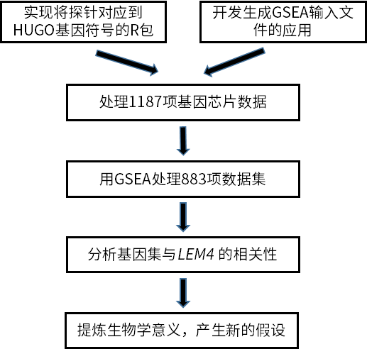
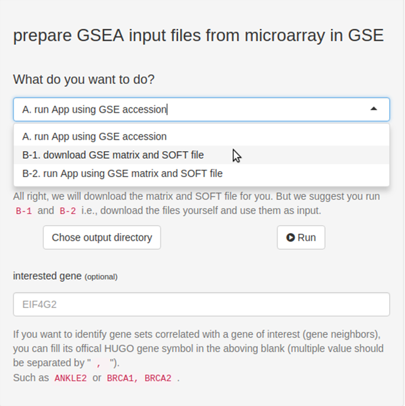
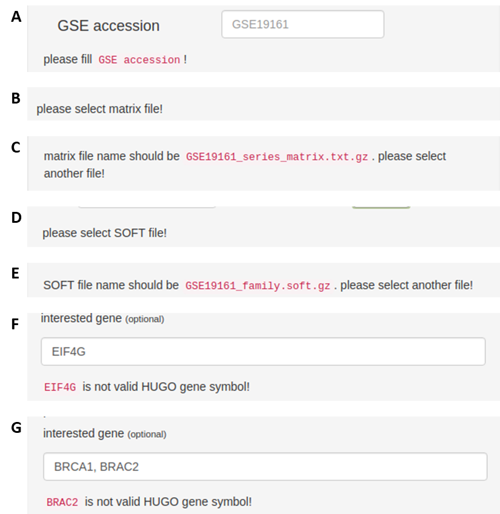

<!--
Refer to [ppt.Rmd](https://github.com/dongzhuoer/thesis/blob/master/ppt.Rmd) for details of data preparation. 
-->

# 封面 {#index .cover}

中文题目：通过临床数据集的基因集富集分析来探究 _LEM4_ 的功能

外文题目：Investigate the function of _LEM4_ using Gene Set Enrichment Analysis (GSEA) in clinical data sets

|       |            |
|:-----:|:----------:|
|   学号  |   1411094  |
|   姓名  |     董卓尔    |
|   年级  |    2014级   |
|   专业  |    生物伯苓    |
|   系别  | 遗传学和细胞生物学系 |
|   学院  |   生命科学学院   |
|  指导教师 |     朱正茂    |
|  完成日期 |   2018年5月  |

-----------------------
  
This work is licensed under a [Creative Commons Attribution-NonCommercial 4.0 International License](http://creativecommons.org/licenses/by-nc/4.0/)

# 摘 要 {#abstract-cn}

储存在 Gene Expression Omnibus（GEO）中的基因芯片数据数量巨大，且仍在不断增加，如何高效地从这些数据中挖掘出有价值的生物学信息一直是一个备受关注的问题。作为一种强大的统计学方法，Subramanian 等人发展的基因集富集分析（Gene Set Enrichment Analysis，GSEA）被广泛地应用于高通量基因表达数据的处理。然而，目前的研究大多仅分析少数数据集，结果的重现性较差；另外，GEO 注释信息格式的混乱，给湿实验研究者使用GSEA造成了较大的阻碍。为了应对上述挑战，我们开发了一个 R 包------rGEO，可以将 GEO 中的基因芯片数据中的探针映射到 HUGO 基因符号，并构建了一个用户界面友好的应用程序------qGSEA，用于将 GEO 中原始数据转换为 GSEA 的输入文件。我们使用这些工具，以 _LEM4_ 基因为例，在883个基因芯片数据集中进行了 GSEA，并筛选出与 _LEM4_ 表达量高度相关的基因集。其中一些信息印证了实验室前期研究或已发表论文的结果，而另一些可能会提供新的生物学见解。此外，我们还发现富集结果的显著性在全部数据集中的整体分布呈现出一些有趣的趋势，这些趋势在仅分析少数几个数据集时是难以发现的。总的来说，我们发布了一套方便的工具，其有助于挖掘 GEO 中丰富的基因表达数据，并进行了使用 GSEA 同时分析大量数据集的早期尝试。rGEO 和 qGSEA 均以 AGPL-3.0 许可证公开发行，并且和本研究中用到的脚本一起存放在 <https://github.com/dongzhuoer/thesis>。

**关键字：** _LEM4_ 基因；基因集富集分析；基因芯片

# Abstract 

The microarray data for gene expression profiling stored in Gene Expression Omnibus (GEO) is massive and ever-increasing, how to effectively mine valuable biological information from these data has always been a concern. As a powerful statistical method, Gene Set Enrichment Analysis (GSEA) advanced by Subramanian _et al_. has been widely used to interpret high-throughout gene expression data. However, current studies usually only analyze a few data sets, resulting in low reproducibility. Moreover, the messy format of annotation information in GEO impedes the application of GSEA for bench biologists. In response to the above challenges, we developed an R package called rGEO which can universally map probes in the microarray data in GEO to HUGO gene symbol, and built a user-friendly web application, qGSEA, for converting raw data in GEO to input files of GSEA. Using _LEM4_ gene as an example, we performed GSEA in 883 microarray data sets with these tools and got several gene sets highly correlated with the expression level of _LEM4_ after filtering. Some information derived from them were consistent with the results of our previous research or published work, while others might provide novel biological insights. We also found that the overall distribution of the significant level of the enrichment results in all data sets shows some interesting trends which are difficult to find when analyzing merely a few data sets. In summary, we introduced a set of convenient tools which facilitates the mining of the abundant gene expression data in GEO and conducted an early attempt to simultaneously analyze a large number of data sets using GSEA. Both rGEO and qGSEA are released under AGPL-3.0 license along with the scripts used in this research at <https://github.com/dongzhuoer/thesis>.

**Keywords**: _LEM4_ gene；Gene Set Enrichment Analysis；DNA microarray

# 一、前言和文献综述 {#preface}

## （一）GEO数据库 {#GEO}

GEO [@GEO2012]（Gene Expression Omnibus，<http://www.ncbi.nlm.nih.gov/geo/>）是 NCBI [@NCBI]（National Center for Biotechnology Information）创建的一个国际化的公共仓库，储存着科研社区提交的高通量基因芯片和新一代测序功能基因组数据集。尽管近年来RNA-seq变得越来越流行，GEO中现存的海量基因芯片数据依然不容忽视，如图 \@ref(fig:geo-data-type)-A 所示，其中蕴藏着宝贵的生物学意义（后文未特殊说明时均仅讨论GEO中的基因芯片数据）。

(\#fig:geo-data-type)GEO 数据库中不同类型的数据分布

A. 不同类型的表达谱数据的分布（截至 2018 年 5 月）。B. GDS 在 GSE 中所占的比例（截至 2018 年 5 月 22 日）。

提交到GEO中的数据分为3种 [@GEO2002]：Platform 被赋予前缀为"GPL"的 accession，包含芯片的总结描述和定义模板的数据表格，该表格每一行代表一个特征（feature），可包含任意列注释信息（提交者提供的序列注释和追踪信息）；Sample 被赋予前缀为"GSM"的 accession，包含生物学材料的描述，实验方法和可包含任意列的数据表格；Series 被赋予前缀为"GSE"的 accession（后文中称为 GSE accession），定义了一组 Sample，其被认为属于某项研究的一部分。简单来说，Platform 代表着芯片，Series 是在某一特定芯片上测量出的数据集，其中的每个个体即为 Sample。

GEO 中储存的高通量实验数据类型广泛，它们由多种方式加工、不同方法分析，这给高效的数据挖掘带来了很大的挑战 [@GEO2005] 。GEO通过一套结合了自动数据提取和人工校对的流程，从用户提交的记录中提取出 Platform 上每个 feature 的序列身份追踪信息、归一化后的表达量测量值和生物学来源及实验目的的文字描述，然后组织成一种高级数据模型------GEO DataSets（GDS，可以认为是 GSE 的一个子集），为下游的数据挖掘和展示工具奠定了基础 [@GEO2009] 。

对于每一项数据集，我们关心的信息主要有两部分：表达量数据和探针注释信息。后一部分甚至更为重要，因为只有知道了每个探针具体对应到哪个基因，我们才能诠释对表达量数据的统计学分析结果的生物学意义。GDS的数据经过了良好的注释，有着一致的格式，在"DataSet full SOFT file"中两部分信息合并成了一个表格。每项数据集的表格都包含许多注释信息，其中 `Entrez Gene symbol` 这一列可用于把探针对应到 HUGO 基因符号 [@HGNC] 上（Entrez Gene [@Entrez] 以纯数字作为唯一标识符，不过每个基因都有对应的"prefered symbol"，即 HUGO 基因符号，故有时也被称为"Entrez Gene symbol"，"Entrez symbol"等）。但 GSE 中的数据格式则没有这么用户友好。表达量数据可以从"Series Matrix File"（后文称其为 matrix 文件）中方便地提取，探针注释信息储存在"SOFT formatted family file"（后文其称为 SOFT 文件）中。

SOFT [@GEO2007]（Simple Omnibus Format in Text）是 GEO 规定的一种简单、基于行、制表符分隔的文件格式,为了快速批量存放数据而设计。虽然 GEO 为 SOFT 文件中储存探针注释信息的表格（后文称其为平台表格，每一项 GSE 数据集都有对应的 Platform，其信息即主要储存于该表格中）制定了详尽的要求，但其格式依然十分混乱，为分析其中的信息带来了很大不便。GEO 只是提出了最低的要求，每一个 SOFT 文件的平台表格必须包含名为"ID"的列（储存探针名称），同时还提供了许多可选的其它列名，如果文件中出现这些列，则必须储存 GEO 规定的信息。除此之外，平台表格中可以包含任意数量的列，它们可以有着任意的列名，储存任意的信息。这就使得确定其中每一列储存的 ID（identifier，标识符）来自哪一个数据库变得非常棘手，我们可以利用的信息只有列名（name）和简短的描述（description），后文将其称为元信息（有的列储存的是 accession，后文中不引起歧义时不再作此说明）。

雪上加霜的是，从实际情况来看，连 GEO 提出的最低要求都没有被严格遵守。比如名为 `ORF` 的列，本应该储存 NCBI's Entrez Genomes
division 鉴定的开放读码框，由于没有规定具体的标准，有些 SOFT 文件储存的是 ID（本段中特指 Entrez Gene ID），另一些储存的是 symbol（本段中特指Entrez Gene symbol，即 HUGO 基因符号）。但是，在 GPL6353 的平台表格中，这一列的描述赫然写着 `Ensembl gene ID`。在 Entrez Genome（<https://www.ncbi.nlm.nih.gov/genome/?term=>）搜索其中一项------`ENSG00000177693`，没有任何结果，而搜索其对应的 ID 或 symbol 都会有结果，另外有些基因是没有对应的"Ensembl gene ID"的（例如 ID 为 `63`、symbol 为 `ACTBP3` 的基因），更别提 Ensembl [@Ensembl] 甚至都不属于 NCBI 的一部分。又比如GPL13915 的平台表格包含两个名为 `GB_ACC` 的列，根据描述，前一个储存"GenBank accession"，后一个储存"RefSeq ID"，先不提 GEO 关于这一列的具体要求，这种情况就连表格的最基本要求（列名必须唯一）都没能满足。其它情形就不一一列举了。

综上可见，将基因芯片数据中的探针对应到 HUGO 基因符号这一听起来理所当然的事情实际上有多么困难。为了接下来的数据分析，我们开发出了一个 R 包------rGEO，将不同平台表格的探针统一地对应到 HUGO 基因符号。我们发现，对于人类（_Homo sapiens_）的基因芯片数据而言，GDS 大概只占到 GSE 的1/10，如图 \@ref(fig:geo-data-type)-B 所示。这表明 rGEO 能够很大地促进研究者分析 GEO 中丰富的数据，从而产生新的生物学发现。

## （二）GSEA及其发展 {#GSEA}

自从基因芯片技术出现以来，科学家一直很感兴趣鉴别差异表达基因和阐明相关的生物学过程。最常用的统计学方法------IGA（individual gene analysis）------评估单个基因在两组样本之间的显著性，并设定一个合适的截断阈值，从而得到一个差异表达基因的列表 [@gene-set] 。随后这个列表通常会用来对基因本体论（Gene Ontology）或代谢通路数据库进行富集分析------通常是基于超几何分布或其二项分布近似的显著性分析------鉴别出过度存在（over-represented）的、行使相似生物学功能的基因类别 [@gene-set-enrich] 。

IGA 的主要问题在于使用了截断阈值。一方面，阈值------通常是任意选定------显著影响富集结果 [@arbitrary-cutoff] ，甚至会严重改变最终的生物学结论 [@threshold-affect-conclusion] 。另一方面，严格的阈值会抛弃许多表达量改变微弱、但有生物学意义的基因，从而减弱统计功效 [@subtle-expr-change] 。而很多重要的生物学过程，例如代谢通路、转录程序、胁迫反应，分散在整个基因网络，在单基因水平表达量变化微弱。

@GSEA 提出了 GSEA（Gene Set Enrichment Analysis）来分析基因表达数据，其专注于基因集，也就是一组共享相同生物学功能、染色体位置或者调控因子等的基因，这样能将已有的生物学知识列入考虑，从而增强了分析能力。GSEA 首先根据芯片上的每个基因与表型的相关系数（或其它排序指标）进行排序得到有序列表L，对于每一个基因集 S，通过遍历L计算出一个累加统计量（遇到在 S 中的基因时增加，遇到不在 S 中的基因时减少）。该累加统计量的最大值或最小值（取对应的绝对值较大者）即为富集分数（Enrichment Score，ES），然后通过重排（permutate）表型标签的方法估算 ES 的经验分布，得到显著性系数，最后矫正多重假设检验。与其它富集方法不同，GSEA 考虑到了实验中全部基因，而不仅仅是其中的一部分（任意选定表达量变化或统计显著性的阈值后进行截断而得到），而且通过重排表型标签计算显著性保留了基因-基因的相互关系，从而提供了更加准确的零模型（null model）。实践表明，相对于 IGA，GSEA 在不同数据集上的分析结果表现出更多的一致性和更好的可重复性，而且更加易于解释。

GSEA 推出后得到了广泛应用，成为了最流行的基因集分析方法之一 [@GSEA-popular] ，同时也有很多研究者在此基础上做出改进。@SAM-GS 认为 GSEA 在鉴别与二态表型关联的生物学代谢通路时有着重要的局限性，故提出了 SAM-GS（Significance Analysis of Microarray to gene-set analyses），并表明其能识别出更多的真正有关联的基因集（其中一半以上基因与表型适度或强烈相关）和更少的无用基因集（其中没有基因与表型相关）。SetRank [@SetRank] 通过舍弃那些仅仅因为与其它基因集重叠而被认为显著的基因集，减少了很多假阳性。PAEA [@PAEA] （Principal Angle Enrichment Analysis）使用降维和多变量方式进行基因集富集分析。GSEA-SNP [@GSEA-SNP] 将 GSEA 的思想引入到 GWAS（genome-wide SNP association studies）中，除了能鉴别作用微弱的标记物，还有助于鉴别与疾病关联的 SNP 和代谢通路，并理解其背后的生物学机制。

GSEA 的一大缺点是在估算统计显著性和矫正多重检验这一步，在重排后的数据集上产生了巨大的计算开销。为了实现有效的大尺度转录组数据分析，paraGSEA [@paraGSEA] 通过优化将时间复杂度从 O(mn)降到了 O(m+n)（m 是基因集长度，n 是基因表达谱的长度），实现了 100 倍的性能提升，在进一步并行加速之后，整个 LINCS（Library of Integrated Network-based Cellular Signatures）一期数据集（GSE92742）的分析时间减少到了 120 小时（96 核工作站）。PAGE [@PAGE] （parametric analysis of gene set enrichment）改进了 GSEA 中的统计模型，使用正态分布来进行统计分析，省去了重复计算，能检测出大量显著改变的基因集，且其 _P_ 值比 GSEA 算出的结果要低。

同时还有许多将 GSEA 的思想拓展到RNA-seq数据分析的尝试。SeqGSEA [@SeqGSEA] 使用 DESeq [@DESeq2] 分析差异表达（differential expression）、DSGSeq [@DSGSeq] 分析差异剪接（differential splicing），然后计算整合之后的得分（gene scores），以此进行基因集富集分析，最后用重排表型的方法计算 _P_ 值，其缺点是每种类别至少需要 5 个样本。尽管近年来测序费用大大降低，对大部分实验室来说生成能达到该要求的样本数量还是过于昂贵 [@RNA-seq-expensive] ，这时只能用重排基因的方式计算 _P_ 值，由于这样打乱了基因-基因的相互关系，很容易造成假阳性。AbsFilterGSEA [@AbsFilterGSEA] 通过计算富集分数的平均值并使用单侧检验，只保留在这种方式和常规方式中均表现为统计显著的结果，大大降低了假阳性率，为小样本的实验提供了一种替代方案。

尽管有着诸多改进，我们发现对于湿实验工作者而言，使用 GSEA 处理数据依然较为困难。以基于 Java 的桌面应用 GSEA-P [@GSEA-P] （后来该软件被改名为 javaGSEA，后文均使用此名称）为例，虽然其有着简单易用的图形化界面和详实的帮助文档，在使用自带的测试文件时给用户带来了很好的体验；但是在分析用户自己的数据（例如从 GEO 下载的公共数据）时，在最开始的一步------准备其需要的输入文件------就能难倒很多人了。具体而言，用户需要首先理解 javaGSEA 的输入文件的格式，然后再读懂 GSE 的原始数据的格式，才能完成格式转换工作。对于湿实验研究者，这意味着在 Microsoft Excel 中操作数小时，而且在 SOFT 文件的平台表格中没有提供 HUGO 基因符号时几乎无法完成；对于生物信息学家，这意味着数至数十行代码，取决于 SOFT 文件的平台表格中是否提供了 HUGO 基因符号。

为了解决这一问题，使广大研究者能够方便地使用 GSEA 这一强大的分析方法去分析 GEO 中丰富的高通量表达数据，我们推出 qGSEA（由 rGEO 提供后台支持）。其拥有基于浏览器的用户界面，用户只需要查询到感兴趣的 GSE 数据集的 accession，即可得到完全符合 javaGSEA 要求的输入文件。qGSEA 不但能使得湿实验工作者也能轻松方便地准备 javaGSEA 所需的输入文件，而且能为经验丰富的生物信息学家节约不少时间。

值得注意的是，虽然 qGSEA 给出的结果是 javaGSEA 所需的输入文件，但这并不意味着 qGSEA 的作用仅限于此。qGSEA 最大的贡献在于将 rGEO 包装成了图形化的界面，基于 GSEA 的改进软件需要的输入信息与 javaGSEA 的大致相同，只是在格式上可能存在细微的差别。只需要对 qGSEA 的代码进行微小的修改，即可以用同样简单易用的方式为这些改进软件提供输入文件。也就是说，我们开发的工具在一定程度上能从整体水平促进基因芯片数据的分析。

## （三）_LEM4_ 的功能 {#LEM4}

LEM（LAP2-Emerin-MAN1）结构域是一段保守的、长度约为 40 氨基酸残基的螺旋-环-螺旋模序，能够与自整合障碍因子（barrier-to-autointegration factor，BAF）相互作用 [@LEM-domain] 。BAF 是一个长度约为 89 氨基酸残基的小蛋白，在染色体聚集、细胞周期和有丝分裂末期细胞核重组装中发挥着至关重要的作用 [@BAF]。BAF 会形成二聚体，通过两个对称的 DNA 结合位点非特异性地桥接双链 DNA，同时还有一个 LEM 结构域结合位点 [@BAF-binding-site] 。LEM 结构域与其它直接结合 DNA 的双螺旋模序------螺旋-延伸-螺旋（helix-extension-helix，HeH）和 SAF-Acinus-PIAS（SAP）模序------高度相关 [@LEM-evolve] 。事实上，在包含 LEM 结构域的代表性蛋白 LAP2 中，还有一段类 LEM 结构域，能够直接结合 DNA [@LEM-domain] 。@LEM-evolve 认为 LEM 结构域可能是从 HeH 和 SAP 结构域，与 BAF 共同进化而来。即使是在明显没有 BAF 和核纤层蛋白的酵母中，LEM 结构域依然保守，暗示 LEM 结构域在基因组组织和细胞核结构中有着内在的重要作用 [@LEM-conservation] 。

目前共发现了由 7 个基因编码的 9 种 LEM 结构域蛋白，构成了 LEM 家族 [@LEM-family] 。依据膜定位的拓扑结构等特征，该家族被划分为 3 组，其中第 III 组的 LEM 结构域位于内部，且含有许多锚蛋白重复，LEM4（由 _ANKLE2_ / _LEM4_ 基因编码）即是一个代表性的例子 [@LEM-localization] 。锚蛋白重复广泛存在于自然界，专门介导蛋白质相互作用，有些与人类癌症发生直接相关 [@ankyrin] 。LEM4 缺乏该家族中典型的跨膜结构域，但是在靠近 N 端的位置有一段疏水链，也许能起到膜锚定作用 [@LEM-N-hydrophobic-anchor] 。与 LAP2、Emerin 和 MAN1 等不同，LEM4 同时定位在内核膜和内质网膜上 [@LEM-localization] 。@LEM-coordinate-kinase-phosphatase 发现在有丝分裂期后期和末期，LEM4 既能抑制 VRK-1 对 BAF 的激酶活性，又能促进 PP2A 复合体对 BAF 的磷酸酶活性，通过对两者的协同调控，LEM4 控制着有丝分裂末期的核膜重建过程。

实验室前期工作发现，LEM4 能够促进乳腺癌的发展，导致三苯氧胺耐药性，并降低患者的生存率。其机理包含如下两种：一是 LEM4 通过与 CDK4 和 Rb 相互作用，增加 Rb 的稳定性和磷酸化水平，从而释放 E2F，促进细胞周期蛋白 E、CDK2 和 E2F 自身的编码基因的转录，如图 \@ref(fig:lem4-promote-breast-cancer)-A 所示。一是 LEM4 通过与 Aurora-A 相互作用，增强 Aurora-A 介导的 ERα 上 Ser167残基的磷酸化，从而促进细胞周期蛋白 D1 和 MYC 编码基因的转录，如图 \@ref(fig:lem4-promote-breast-cancer)-B 所示。这两种机理均能推动 G1 期到 S 期的转化。

(\#fig:lem4-promote-breast-cancer)LEM4 导致三苯氧胺耐药性的分子机制

A. LEM4 调控细胞周期蛋白 D-CDK4/6-Rb 轴。B. LEM4 调控 ERα 信号通路。

为了验证实验结果和发现新的研究靶点，我们从 GEO 下载了临床病人的基因芯片数据，使用 qGSEA 转换原始数据文件，然后运用 GSEA 进行富集分析。将许多数据集的结果整合在一起后，我们构建出衡量基因集与 _LEM4_ 表达量相关性的指数，并依此筛选出最突出的基因集。在对这些基因集的生物学意义加以分析之后，我们发现其中一部分很好地重现了前期实验或已发表论文的结果，另一些则提供了新的研究靶点。

# 二、材料与方法 {#material-method}

## （一）实验数据与软件 {#data-software}

我们从 GSE 中筛选物种为 _`Homo sapiens`_ ，类型为 `Expression profiling by array`，标题中同时包含乳腺或卵巢（`breast|ovarian`）和癌（`cancer|adenocarcinoma|carcinoma|tumor`）的数据集，共 1 187个（截至 2018 年 04 月 17 日）。

我们从 Broad 研究所网站（<http://www.broadinstitute.org/gsea/index.jsp>）下载了 GSEA 软件（Java 实现版本，javaGSEA 3.0）和基因集数据库  MSigDB [@MSigDB] （Molecular Signatures Database）v6.1（共包含 17 786个 基因集）。

所有的数据分析均在 R 语言 3.4.4 中完成。

## （二）实验方法 {#method}

### 1. rGEO算法实现 {#rGEO}

为了确定 SOFT 文件的平台表格中每一列储存的 ID 来自哪一个数据库，我们通过正则表达式去挖掘列名和描述中的信息，比如既包含 `entrez`、又包含 `id` 的列储存的应该就是 Entrez Gene ID，同时对所有符合条件的列的列名和描述进行人工复查，剔除可能有问题的情况，比如在上述条件下额外包含 `unigene` 的列实际上储存的是 UniGene [@UniGene] ID，此时规则就应该修改为，既包含 `entrez`、又包含 `id` 且不包含 `unigene`。

在实际操作中，我们发现有时候很难区分某一列储存的到底是 Entrez Gene ID 还是 HUGO 基因符号，注意到这两者之间没有任何重叠，我们将其合并为一个新的 ID------`entrez_or_symbol`，该 ID 可用于将这些难以界定的列对应到 HUGO 基因符号。同理，我们从 INSDC [@INSDC] accession（有时也被称为 GenBank [@GenBank] accession）和 RefSeq [@RefSeq] accession （nucleotide）合并得到 `genbank` 这一新 ID。

就这样，我们为常见数据库的 ID 都生成了相应的规则，将其应用到具体的平台表格则可以知道特定数据库的 ID 存储于哪一列。对于未来新增加的数据，可能会出现新的特例，但是我们制定的这些规则在大部分情况下还是适用的，同时这些规则具有很好的可扩展性，可以在未来进行定期增量更新。

接下来我们需要将其它数据库的 ID 对应到 HUGO 基因符号，如图 \@ref(fig:probe-to-symbol) 所示。我们从 HGNC [@HGNC]（<https://www.genenames.org/help/statistics-downloads>）下载了 `hgnc_complete_set.txt` 文件，实现了从常见数据库的 ID 到 HUGO 基因符号之间的对应，具体包括 Entrez Gene ID、Ensembl gene ID、INSDC accession、RefSeq accession（nucleotide）。我们还从 NCBI（<ftp://ftp.ncbi.nlm.nih.gov/gene/DATA/gene2unigene>）下载了 `gene2unigene.tsv` 文件，其中包含了 Entrez Gene ID 与 UniGene ID 之间的对应关系，结合前文，就实现了 UniGene ID 与 HUGO 基因符号之间的对应。至此，经过一到两次转换即可将 SOFT 文件中的探针对应到 HUGO 基因符号。

(\#fig:probe-to-symbol)将探针对应到 HUGO 基因符号（以通过Ensembl Gene ID 为例）

但是一个麻烦在于这些对应关系中经常包含一对多的情况。javaGSEA 允许一个探针对应到一个或多个 HUGO 基因符号，但是直接将一对多对应中的其它数据库的 ID 替换为 HUGO 基因符号会造成很大的计算开销。为此，我们首先将这些一对多对应拆分成多个一对一对应，然后把它们和剩下的一对一的对应合并（前文提到的文件中也存在一对多对应，我们就是通过这两步得到由其它数据库的 ID 到 HUGO 基因符号的一对一对应），接下来将其它数据库的 ID 对应到 HUGO 基因符号，最后将重复的一对一对应折叠成一对多对应并与剩下的一对一对应合并，如图 3 所示。

在这个过程中的另一个麻烦在于 SOFT 文件的混乱。比如，在前文提到的一对多对应中，不同平台表格中用于分割 ID 的间隔符就不统一，有 `,`，` /// `， `, `等。我们巧妙地利用正则表达式中的反向匹配规则，不去拘泥于分析确切的间隔符，而是将不会在 ID 中出现的字符一律视为间隔符。例如 Entrez Gene ID 完全由数字组成，那么任何非数字的字符均会被视为间隔符。

我们将上述过程中用到的 R 语言代码分割成相对独立的函数，并在设计的过程中加入了可扩展性和重用性的考虑，这样既有助于将来的更新，也方便其它研究者完成类似的任务。

### 2. qGSEA软件实现 {#qGSEA}

qGSEA 基于 Shiny 而开发，有两种运行模式------A 和 B，其中模式 B 又分为 B-1 和 B-2 两步。

在模式 A 中，我们根据用户提供的 GSE accession 计算出 matrix 文件和 SOFT 文件的链接，然后用 R 语言内置的函数去下载上述文件，接下来我们在后台调用 rGEO 来完成探针到 HUGO 基因符号的对应，最后生成 javaGSEA 的输入文件并将其写入用户指定的输出文件夹中（选择文件或文件夹的功能由 shinyFiles 包提供）。

在 B-1 中，我们根据用户提供的 GSE accession，使用 shinyjs 包提供的 `runjs()` 函数运行 JavaScript 代码，实现实时更新 `Download matrix file` 和 `Download SOFT file` 这两个按钮对应的链接。同时修改按钮的 `onclick()` 句柄，使其触发按钮内链接文字（`<a>` 元素）的 `click()` 事件，从而实现单击按钮或按钮内的文字均能下载文件的效果。在 B-2 中，我们仍需要用户提供 GSE accession，这样一方面便于确定生成文件的文件名，另一方面也可以验证用户是否选择了正确的原始数据文件（这里我们假定用户不会修改 B-1 中下载的原始数据的文件名，对于确实需要修改文件名的高级用户，可以直接使用 rGEO 中提供的接口），其它方面与模式 A 相似。

在运行过程中出现错误后的提示信息均使用 JavaScript 来实现动态更新。由于文件（夹）选择控件目前还未支持 Shiny 控件的全部标准，而且同时显示太多信息容易干扰用户的决策，大部分控件的提示信息都是在点击 `Run` 之后才会更新。但是在 B-1 中没有 `Run` 按钮，故我们将 GSE accession 的提示信息设置为及时更新（在输入框的状态发生变化后就会立即更新）。

### 3. GSEA及其结果的整合 {#GSEA-and-integration}

我们使用 MSigDB 中的 13 个基因集集合（collection），如表 1 所示，以 _LEM4_ 的表达量作为表型标签，Metric 选择 `Pearson`，其它参数均选用默认值。因为基于重排表型的显著性估计方法能很好地控制假阳性，而且我们这里的主要目的是生成假设，根据 GSEA 团队的推荐，我们用 FDR < 0.25 来判定统计显著性。但使用这样较大的 FDR 阈值之后，被判定为统计显著的基因集的 FDR 之间会存在较大差异，而仅使用某一基因集表现为统计显著的数据集数目 n，来评估其与 _LEM4_ 之间的相关性则忽略了这一差异。于是，在计算 n 时，我们减去了筛选出的基因集的 FDR 的总和，使得其含义变为某一基因集表现为真阳性的数据集数目的估计值。这样可以给予 FDR 小的基因集更大的权重，从而加强统计分析的效度。

Table: 表 1 　运行GSEA时使用的基因集集合

名称             描述
---------------- --------------------------------
h                特征（hallmark）基因集 [@MSigDB-hallmark] 
c1               位置基因集
c2.cgp           化学和遗传学扰动
c2.cp.biocarta   BioCarta 基因集
c2.cp.kegg       KEGG 基因集
c2.cp.reactome   Reactome 基因集
c3.mir           microRNA 靶基因
c3.tft           转录因子靶基因
c4.cgn           癌症基因邻居
c4.cm            癌症模块
c5               GO 基因集
c6               癌基因标志（signature）
c7               免疫标志

## （三）实验流程图 {#diagram}

 

# 三、实验数据与结果 {#result}

## （一）rGEO------将探针对应到 HUGO 基因符号 {#probe2symbol}

我们实现了将 GSE 数据集中的探针统一地对应到 HUGO 基因符号的 R 包------rGEO。截至 2018 年 5 月 22 日，GSE中物种为人类的平台表格一共有 4 868种，我们获取了所有平台表格的元信息，然后用我们开发的R包进行处理，结果如图 \@ref(fig:rGEO-performance)-A 所示。由于 GSEA 自带的基因集数据库------MSigDB------主要用于分析蛋白质编码基因，我们暂不考虑支持非编码 RNA 的基因芯片。对于五分之一左右的平台表格，rGEO 无法直接将探针对应到基因，但是可以提取出探针序列信息，在后续的改进中可以考虑通过 BLAST 到人类基因组来确定探针所对应的基因。另有六分之一左右的平台表格完全无法处理，其分为两种情况，一是根本没有任何可利用信息，一是无法通过编程来批量提取出可用信息。在数据处理过程中，我们注意到不同的平台表格在 GSE 数据集中的使用频率变异较大，于是我们以数据集为单位分析了 rGEO 的表现（每一个数据集均有一个唯一的平台表格与之对应），结果如图 \@ref(fig:rGEO-performance)-B 所示（为了避免重复，我们舍弃了 Super Series，因为其包含的子数据集均已被纳入分析范围）。可以看出，我们开发的 R 包可以处理 GEO 中绝大部分物种为人类的数据集。

(\#fig:rGEO-performance)rGEO 的表现

A. 对所有物种为人类的平台表格的处理情况。B. 对所有物种为人类的数据集的处理情况。

## （二）qGSEA------快捷运行 GSEA {#quick-run-GSEA}

在前文提到的 R 包的基础上，我们开发出了一个简单易用的网页应用 qGSEA，如图S1所示。其拥有用户友好的交互式界面，能够很方便地将 GSE 数据集的原始文件转换为 javaGSEA 需要的输入文件，从而使用户能快捷地使用 GSEA 这一强大的分析工具。qGSEA 有两种运行模式：A 和 B，如图 \@ref(fig:qGSEA-usage) 所示。

(\#fig:qGSEA-usage)qGSEA 的使用方法

A. 模式 A 的操作步骤。B. 模式 B-1 的操作步骤。C. 模式 B-2 的操作步骤。

对于模式 A，用户需要输入 GSE accession，然后选择存放输出文件的文件夹，最后点击 `Run`，即可在之前选择的文件夹中得到符合 javaGSEA 规范的输入文件，如图 \@ref(fig:qGSEA-usage)-A 所示。在实际使用过程中，我们发现从 NCBI 下载数据十分缓慢，当文件较大时需要耗费较长时间，而且网络连接非常不稳定，有时甚至会完全卡死。基于这种情况，我们提供了另一种运行方法------模式 B------先由用户下载 GSE 的原始数据文件，然后再由这些文件得到 javaGSEA 需要的输入文件。

模式 B 分为 B-1、B-2 两步。在 B-1 中，用户需要输入 GSE accession，然后单击下方的两个按钮即可下载 GSE 的原始数据文件------matrix 文件和 SOFT 文件，如图 \@ref(fig:qGSEA-usage)-B所示。此时文件是通过浏览器来下载，用户可以查看下载进度，在下载失败后重新下载，或者复制下载链接之后通过其它方式来下载（比如使用专门的下载软件，或者等到网络环境较好的时候再下载）。不管通过何种方式，在用户得到 GSE 的原始数据文件之后，即可运行 B-2。用户仍需输入 GSE accession（如果在 B-1中已经输入过，则此时会被保留，无需重复输入），然后分别选中下载好的 matrix 文件和 SOFT 文件，以及输出文件夹，最后点击 `Run` 即可得到与模式A一样的结果，如图 \@ref(fig:qGSEA-usage)-C所示。

除了上述提到的必要步骤之外，在 A 和 B-2 中还提供了一项可选步骤。当用户希望使用 GSEA 筛选出与某一感兴趣的基因的表达相关联的基因集时，可以在最下方的框中输入该基因的 HUGO 基因符号。这样 qGSEA 就会额外生成一个 `.cls` 文件，在 javaGSEA 中该文件用于提供表型标签。

运行完qGSEA之后的任务就十分简单明了了，用户只需要把生成的文件拖拽到 javaGSEA 中，然后按照其指示即可得到分析结果。

qGSEA 的一大亮点是，在软件运行的整个过程中都会对用户的错误给出简短、清晰的提示，当用户修正该错误后提示会立即消失，在用户犯了新的错误后又会给出新的提示，从而引导用户一步一步达成运行软件的目的，如图 S2 所示。这些提示进一步增强了 qGSEA 的易用性，即使是第一次接触 qGSEA 的用户，也能够在指示的引导下正确地运行软件。而且在用户修正所有的错误之前，qGSEA 会拒绝运行，这样就大大减少了产生错误输出的可能性。

## （三）在883项数据集中运行GSEA并整合结果 {#GSEA-883-dataset}

### 1. 运行GSEA {#run-GSEA}

我们从 GEO 数据库获取了 1 187项人类乳腺癌或卵巢癌相关的数据集，然后使用 qGSEA 从原始数据文件生成 javaGSEA 输入文件。其中有 21 项无法被 qGSEA 识别，剩下的 1 166项数据集中只有 883 项包含了 _LEM4_ 基因，我们在这些数据中进行了 GSEA。

由于我们使用重排表型（1 000次）的方式计算 _P_ 值，为了实现足够的分辨率，每一数据集样本数至少为 7。我们发现样本数多的数据集倾向于产生更多统计显著的结果（数据未显示），这可能是因为大样本的数据集有着更高的信噪比。考虑到以上两点，我们仅选取样本数超过某一阈值的数据集的结果进行后续分析，但是阈值设置过高又会导致可用的数据集太少，以至于损失过多有用信息。权衡利弊之后，我们选取样本数超过 100（包含 100）的数据集（共 108 项）。

### 2. 整体分析GSEA的结果 {#integrate-result}

我们分析了不同集合整体的情况，如图 \@ref(fig:significant-geneset-per-dataset) 所示。我们认为 c3.mir、c4.cgn 和 c7这3个集合表现比较奇怪。在正常情况下，每个数据集中应该只有一小部分统计显著的基因集，在其它集合中，绝大部分数据集都与该情况相符。但是在 c3.mir、c4.cgn 和 c7 中，有相当一部分数据集都给出了很多（甚至绝大部分都是）统计显著的基因集。我们认为造成该现象的原因有两种，一是该集合中的基因集组成不合理，容易产生假阳性；一是 _LEM4_ 确实能通过某种生物学机制影响到该集合中的大部分基因集。针对 c3.mir，LEM4 部分定位于内质网上，在维持内质网的形态中起到重要的作用，而内质网又是 microRNA 加工的重要场所，我们推测 LEM4 可能会通过影响内质网的稳定性来影响 microRNA 的加工，从而影响 c3.mir 中的大部分基因集。针对 c4.cgn，实验室前期研究发现 _LEM4_ 在乳腺癌和卵巢癌中是重要的癌基因，能够影响抑癌基因 _RB1_ 和原癌基因 _MYC_，我们推测 _LEM4_ 可能通过癌基因之间的关系网络来影响 c4.cgn 中的大部分基因集。至于 _LEM4_ 与 c7 集合的关系，目前还不清楚。

(\#fig:significant-geneset-per-dataset)各个集合在不同数据集中的整体表现

接下来，我们希望筛选出与 _LEM4_ 相关性最强的基因集。我们将不同数据集的结果整合在一起，发现它们之间的一致性较差，即统计显著的基因集重合度较低。于是我们使用某一基因集表现为统计显著的数据集数目n，来衡量该基因集与 _LEM4_ 的相关程度（具体计算方法见"材料与方法"部分）。我们注意到并非每一个基因集都在所有数据集中进行了 GSEA，于是我们计算出了某一基因集进行了 GSEA 的数据集数目 N。这一现象意味着在评估 n 时，N 也是一个不可忽略的因素，因为如果一个与 _LEM4_ 真正相关的基因集只在较少数据集中进行了 GSEA，那么与在较多数据集中进行了 GSEA 的噪音基因集相比，前者的 n 值可能反而会更低。

为了找出影响 N 的因素，我们检查了 GSEA 的输出日志，发现上述基因集在特定数据集中被包含的基因太少，以至于无法进行富集分析。由于基因芯片在本质上就不一定能完全覆盖转录组，而且在基因注释等处理环节可能会产生疏漏，我们决定不筛除对转录组覆盖率低的数据集，以避免损失有效信息。一种可行的改进方法是，用 n 与 N 的比值作为衡量基因集与 _LEM4_ 相关性的指标。但是这样做会带来另一个问题，即当一个基因集的 N 较小时，难以区分随机因素与生物学效应对该指标的影响。考虑到我们的主要目的是发现新的研究靶点，我们决定牺牲灵敏度、确保特异度，仍然使用 n 作为主要评估指标，同时给出 N 作为决策的参考依据。为避免数据异质性的影响，我们排除了 c3.mir、c4.cgn 和 c7 这三个集合，同时排除了其它集合中包含过多（25% 及以上）统计显著的基因集的数据集。

由于每个集合中都有很多 n 值很小的基因集，为了更好地展示数据分布，我们从每个集合中分别选取前 10 位正相关和前 10 位负相关的基因集，如图 \@ref(fig:significant-dataset-per-geneset) 所示。可以看出不同集合之间存在明显差异，而且正相关的基因集的 n 值明显大于负相关。为了探索其原因，我们推测该现象可能与 _LEM4_ 基因本身的性质有关，于是我们分析了 _BRCA1_、_BRCA2_、_TP53_、_MYC_ 和 _NOTCH1_ 这5个基因（数据未显示），均发现了类似的趋势，暗示 GSEA 这一分析本身可能存在偏差。接下来的分析主要专注于正相关的基因集。

(\#fig:significant-dataset-per-geneset)各个集合中前 10 位正相关和前 10 位负相关的基因集

### 3. 探索筛选基因集的方法 {#how-filter-geneset}

为了筛选出与 _LEM4_ 相关性最强的基因集，一个直观的想法也许是取 n 排名靠前（如前 25）的基因集，如表 S1 所示。但是这样会导致有些集合会有较多基因集入选，而另一些则较少，例如有 10 个基因集来自 c3.tft，而来自 h 的基因集一个都没有。为了应对这一问题，一种方案是同时保留整体排名靠前（如前 15）和在各自集合中分别排名靠前（如前 2）的基因集。为了评价该方案的合理性，我们对 c1、c3.tft 和 h 这三个集合进行了深入探索，如表 S2 所示。

c1 集合整体表现不是很好，但是其中最靠前的基因集 `CHR12Q24`（n=36）恰好与 c2.cgp 中排名第 5 的基因集 `NIKOLSKY_BREAST_CANCER_12Q24_AMPLICON`（n=28）相符合（见表 S1），后者是 @chr12q24-amplicon 在乳腺癌中鉴定出一个扩增子（amplicon）。而排名第二的基因集 `CHR12Q23` 的 n 值则仅为 11（见表S2），可能仅仅只是因为与 `CHR12Q24` 距离较近。后面的基因集的 n 值就都不怎么突出了。

c3.tft 这一集合中，排名前 10 的基因集均为 E2F 转录因子家族。这一结果确实得到了实验室前期实验证据的直接支持，但是冗余度太高。

h 集合中排名前 8 位的基因集的 n 值均较为突出，但是我们发现前 5 位和第 6 至 8 位之间存在明显的分界线。从生物学意义来看，`E2F_TARGETS`、`MYC_TARGETS_V1` 和 `MYC_TARGETS_V2` 均能被实验室前期的实验证据直接支持，而 `MITOTIC_SPINDLE` 和 `G2M_CHECKPOINT` 则与 _LEM4_ 在细胞周期中重要作用吻合，但是 `MTORC1_SIGNALING`、`DNA_REPAIR` 和 `UNFOLDED_PROTEIN_RESPONSE` 则与 _LEM4_ 目前已知的功能几乎没有关系（基因集名称均省略了前缀 `HALLMARK_`）。结合以上两点，我们认为第 6 至 8 位基因集是假阳性结果，其原因可能是与前 5 位的基因集有较多重合的基因。为了验证这一点，我们利用 MSigDB 提供的重合分析工具（<http://software.broadinstitute.org/gsea/msigdb/help_annotations.jsp#overlap>）搜索了这三个基因集，如图 \@ref(fig:geneset-overlap) 所示，可以看出它们分别与前 5 的基因集中的 2、2 和 4 个有明显的重合。作为对照，对于每个基因集，我们都从 h 集合中选取了相同类别且大小相近的两个基因集进行同样的搜索，如图 S3 所示，共计 6 个基因集中只有 1 个与前 5 的基因集中的 1 个有明显重合（另有 1 个与前 5 的基因集中的 1 个有不太明显的重合），从而验证了我们的想法。

(\#fig:geneset-overlap)h 集合中第 6 至 8 位基因集均与某些前 5 位基因集存在明显重合

A. `HALLMARK_MTORC1_SIGNALING`。B. `HALLMARK_DNA_REPAIR`。 C. `HALLMARK_UNFOLDED_PROTEIN_RESPONSE`。

### 4. 筛选最终结果并分析其生物学意义 {#filter-and-explain}

根据前文的探究，我们觉得应该针对每个集合的情况进行具体分析，既要选出该集合中 n 值最突出的基因集（与其它基因集存在明显的差异），也要考虑该集合能提供的生物学信息。如果对所有集合都采用同一标准（比如取前 2 位基因集）的话，在某些集合（比如 h）中会损失重要的信息，在某些集合（比如 c3.tft）中又产生会多余的信息。

具体来说，我们从每个集合中筛选出 n 值最突出的少量基因集（一般不超过 3 个，考虑到 h 集合的特殊性，我们选取了 5 个），作为核心基因集，用于产生生物学假设，如表 S3 所示。从其它排名靠前的基因集中挑出与核心基因集有关的部分，作为补充基因集，用于支持和具化假设。

核心基因集中有一些能被实验室前期的研究或已发表的论文直接支持，包括参与有丝分裂后核膜重建、调控细胞周期蛋白 D-CDK4/6-Rb 轴和调控 ERα 信号通路，如表 2 所示（能够支持这些功能的补充基因集如表 S4 所示）。这说明了我们的分析流程的合理性，也暗示核心基因集中的其它成员很可能揭示了 _LEM4_ 尚未被发现的其它功能。

Table: 表 2 与 _LEM4_ 相关性最强的核心基因集及其生物学意义

集合                                          基因集                                                       N    n
--------------------------------------------- ------------------------------------------------------------ ---- ----
_LEM4_ 已知的生物学功能                                                                                          
（1）参与有丝分裂后核膜重建                                                                                     
c5                                            `GO_NUCLEAR_ENVELOPE_ORGANIZATION`                           86   28
（2）调控细胞周期蛋白 D-CDK4/6-Rb 轴                                                                              
h                                             `HALLMARK_E2F_TARGETS`                                       71   23
c2.cp.biocarta                                `BIOCARTA_G1_PATHWAY`                                        79   23
c3.tft                                        `E2F_Q3_01`                                                  72   30
c6                                            `RB_P107_DN.V1_UP`                                           76   28
（3）调控 ERα 信号通路                                                                                            
h                                             `HALLMARK_MYC_TARGETS_V1`                                    67   22
h                                             `HALLMARK_MYC_TARGETS_V2`                                    73   19
&nbsp;                                                                                                                
_LEM4_ 可能的新的生物学功能                                                                                      
（1）在 G2 期到 M 期的转化中起到关键作用                                                                            
h                                             `HALLMARK_G2M_CHECKPOINT`                                    76   24
c2.cp.biocarta                                `BIOCARTA_G2_PATHWAY`                                        79   22
（2）通过影响微管蛋白，从而影响纺锤体的形成                                                                     
h                                             `HALLMARK_MITOTIC_SPINDLE`                                   71   25
（3）调控 S 期 CDK，从而促进 DNA 复制                                                                                
c2.cp.biocarta                                `BIOCARTA_MCM_PATHWAY`                                       79   20
（4）直接影响核孔的 RNA 转运功能                                                                                  
c2.cp.reactome                                `REACTOME_TRANSPORT_OF_MATURE_TRANSCRIPT_TO_CYTOPLASM`       72   15
c5                                            `GO_NUCLEAR_PORE`                                            84   28

N，某一基因集进行了GSEA的数据集数目，n，某一基因集表现为统计显著的数据集数目（后文的表格中不再解释）。

在此基础上，我们从其它核心基因集中筛选出与 _LEM4_ 已知的生物学功能相符合的部分，从中总结出 4 项 _LEM4_ 可能的新功能，如表 2 所示。其中一些功能得到了补充基因集的支持，另一些则依赖补充基因集来启发我们具体的作用机制，如表 3 所示。关于 LEM4 影响纺锤体的方式，我们认为其影响了微管的聚合和解聚；关于 _LEM4_ 对核孔的影响，我们根据多个与RNA转运有关的基因集，猜想 LEM4 除了影响核膜形成之外，会能直接与核孔复合体相互作用，影响 RNA（包括 mRNA 和 tRNA）的转运。

Table: 表 3 用于支持 _LEM4_ 可能的新功能的补充基因集（编号与表 2 中的相对应）

集合                                          基因集                                                                             N    n
--------------------------------------------- ---------------------------------------------------------------------------------- ---- ----
（1）在 G2 期到 M 期的转化中起到关键作用                                                                                                  
c2.cp.reactome                                `REACTOME_MITOTIC_G2_G2_M_PHASES`                                                  66   14
（2）通过影响微管蛋白，从而影响纺锤体的形成                                                                                           
c5.all                                        `GO_REGULATION_OF_MICROTUBULE_POLYMERIZATION_OR_DEPOLYMERIZATION`                  85   26
c5.all                                        `GO_REGULATION_OF_MICROTUBULE_BASED_PROCESS`                                       85   25
c5.all                                        `GO_MITOTIC_SPINDLE`                                                               82   25
（3）调控 S 期CDK，从而促进 DNA 复制                                                                                                      
c5.all                                        `GO_ATP_DEPENDENT_DNA_HELICASE_ACTIVITY`                                           89   26
c5.all                                        `GO_DNA_HELICASE_ACTIVITY`                                                         91   26
（4）直接影响核孔的 RNA 转运功能                                                                                                        
c2.cp.reactome                                `REACTOME_TRANSPORT_OF_MATURE_MRNA_DERIVED_FROM_AN_INTRONLESS_TRANSCRIPT`          64   14
c5.all                                        `GO_TRNA_TRANSPORT`                                                                83   25

# 四、讨论与分析 {#discuss}

## （一）进一步增强易用性 {#easy-use}

与目前已有的应用 GSEA 的软件相比，qGSEA 以非常友好的用户界面解决了难以准备 javaGSEA 的输入文件的难题。但是，我们也应该看到，该软件还有较大的改进空间。对于 javaGSEA 的4大输入文件------表达数据（Expression dataset）文件、表型标签（Phenotype labels）文件、基因集（Gene sets）文件和芯片注释（Chip annotations）文件，第 1、4 项在 qGSEA 中已经得到很好的支持，第 3 项可以由 MSigDB 提供，而第 2 项目前仍比较麻烦。

 javaGSEA 提供了为用户制作表型文件的功能，对于离散型表型，用户需要在两个文本框（对应两种表型）中输入每个样本（sample）的名字；当以某一基因的表达量作为表型时，界面变得较为友好，用户可以从现成的列表中选择基因，也可以对基因名进行搜索，但是需要事先折叠（collapse）数据集，如图 S4 所示（由于 javaGSEA 的主程序默认会自动折叠数据集，qGSEA 提供的结果是未折叠的数据集）。

对于表型文件，qGSEA 提供了一个可选项，用户可以在运行前输入一至多个基因符号，这样运行后会额外生成一个连续型表型文件，省去了在 javaGSEA 中执行折叠数据集这一操作的麻烦（此时用户尚未点击 `Run`，也就是说原始数据文件还没有被解析，故无法提供 javaGSEA 中的选择和搜索功能）。

我们注意到，GSE 的 matrix 文件中包含了丰富的关于 sample 的信息，其中某些也许可以作为表型，比如 GSE19161 的 61 个样本就可以根据 `event indicator` 分为 `censored` 和 `event` 两类。我们计划在 qGSEA 中新增一个组件，用于生成表型文件。对于连续型表型，我们从 matrix 文件中提取出可能有用的信息供用户选择，对于含有较多样本的数据集，这样能大大节省用户的时间；以基因作为表型时，我们会提供类似前面提到的选择和搜索功能，使用户在不用执行折叠数据集这一操作的情况下也能享受方便的操作。

## （二）支持更多的平台表格 {#more-platform}

在将探针对应到 HUGO 基因符号的过程中，还剩一部分平台表格没有被解析。对于存在可用信息，但无法通过编程来批量提取的情况，在具体的研究中可以使用人工分析。但 rGEO 的核心思想是开发出通用的规则，这样可以更好地应对不断增加的数据（新增加的数据中的大部分应该也能被这些规则处理），故我们并不打算完全覆盖每一个特例。

对于那些提供了探针序列的平台文件，可以考虑将序列 BLAST 到人类基因组上，根据得分最高的结果（hit）来确定该探针对应的基因。需要指出的是，该方法应该给予最低的优先级，即只有在没有其它信息可用时，才使用该方法。因为基因芯片是为了特定的靶点而设计的，很多情况下探针的靶基因并不能通过简单地比较 BLAST 得分而确定，而是需要考虑除了序列相似性之外的诸多因素。平台文件中的注释（来自不同数据库的 ID 等）正是厂商在综合考虑这些信息之后给出的。在后续的研究中，我们计划深入挖掘目前还未解析的平台中的注释信息，对于仍无法解析的平台文件，取探针序列 BLAST 到最新的人类基因组组装 GRCh38 后得分最高的基因。

## （三）整合多项数据集的GSEA结果的优势 {#merit-of-integration}

我们进行了整合多项数据集的 GSEA 结果的早期尝试，得到了富集结果的显著性在全部数据集中的整体分布，从中发现了一些有趣的趋势，这些趋势在仅分析少数几个数据集时是难以发现的。

我们发现对于 c3 和 c4.cgn 集合，很多数据集均呈现出较大比例（甚至全部）的统计显著的基因集，如图 5 所示，这一现象无法用随机性来解释，于是提示我们 _LEM4_ 可能会影响 miRNA 的加工和参与了许多（抑）癌基因之间的作用网络。当然，这只是一个初步的猜想，还需要更多的证据来支持。关于 _LEM4_ 通过影响内质网的稳定性来影响 microRNA 的加工的猜想，我们计划在相同的数据集中对其它基因进行 GSEA，包括负责 microRNA 加工的关键基因、维持内质网正常形态的关键基因和与以上两者都无关的基因。而关于 _LEM4_ 参与到癌基因之间的关系网络的猜想，我们则计划对 _TP53_、_RB_ 等重要的（抑）癌基因和与癌症基本无关的基因进行 GSEA。除了提供生物学猜想之外，图5 还提供了另一点很重要的信息，即在后续筛选与 _LEM4_ 相关性最强的基因集的过程中，应该排除 c3、c4.cgn 和 c7 集合。这是因为在其它集合中，一个基因集是否统计显著取决于其与 _LEM4_ 的相关性的强弱，而在上述三个集合中这一点主要由随机因素决定，将二者混杂在一起会减弱统计分析的效度，使我们难以从全部基因集中区分出与 _LEM4_ 最相关的那一小部分。但是，如果仅分析少数几个数据集，我们很可能无法发现两类集合之间这一不容忽视的差别

由于不同数据集的结果之间存在很大的差异，我们引入 n 值来衡量基因集与 _LEM4_ 的相关程度。我们发现，正相关的基因集中排名靠前部分的 n 值明显大于负相关的，这一趋势在 _BRCA1_、_BRCA2_、_TP53_、_MYC_ 和 _NOTCH1_ 中均存在，于是我们开始从 GSEA 本身的分析方法中探索原因。GSEA 的富集分数是通过在基因集 S 中遍历有序列表 L 得到的，我们在分析流程中将参数 P 设置为 1，也就是对 S 中的基因按照其与表型的相关程度进行加权，而不在 S 中的基因则不进行加权。另外，我们限定基因集的大小上限为 500，这意味着通常情况下不在 S 中的基因远多于在 S 中的。以上两点造成了累加统计量的增加和减少的不对称性，可能会造成 ES 更倾向于取正值。但是，从 L 逆序来看时，累加统计量变为由在 S 中的基因减少、不在 S 中的基因增加，也就是说 ES 的正值与负值应该是对称的。综上所述，该问题有待进一步探究。

以 h 集合为例，我们从 n 值的间断性得到启发，发现了基因集之间的相互重合造成的假阳性，这一点在仅分析少量数据集时是难以做到的。例如我们从 `HALLMARK_MTORC1_SIGNALING` 表现为统计显著的数据集中随机抽取出 GSE64073，其中所有统计显著的基因集如表 4 所示。可以看出，在前文总结出的 h 集合中的 5 个核心基因集中只出现了 `HALLMARK_MYC_TARGETS_V2`，而且其 FDR 值还是最大的。如果仅分析这一个数据集，对 h 集合而言，最后的结果就是给出了 1 个真阳性的基因集和 5 个假阳性的基因集，同时认为真阳性的基因集反而是最不可靠的。由此可以看出使用 n 值评价基因集的优越性。前文中提到的SetRank [@SetRank] 首先计算出原始 _P_ 值，然后分析显著重叠的基因集对，接着针对其中每一对基因集计算出新的 _P_ 值，由此筛选出某一基因集的显著性是由与其它基因集的重叠而导致的情况，最后将这些情况整合成有向图，从而决定应该被舍弃的假阳性基因集。这一方面验证了我们的结论，另一方面也为更准确地去除这种假阳性提供了思路，因为其与真阳性基因集的 n 值之间并不总会表现出明显的间断。

Table: 表 4 GSE64073 数据集中统计显著的基因集（FDR < 0.25）

集合   基因集                                  P      FDR
------ --------------------------------------- ------ ------
c6     `MYC_UP.V1_UP`                          0.01   0.21
c6     `RPS14_DN.V1_DN`                        0.03   0.25
c6     `MEL18_DN.V1_UP`                        0.05   0.25
h      `HALLMARK_MYC_TARGETS_V2`               0.01   0.23
h      `HALLMARK_UNFOLDED_PROTEIN_RESPONSE`    0.04   0.19
h      `HALLMARK_MTORC1_SIGNALING`             0.06   0.16
h      `HALLMARK_GLYCOLYSIS`                   0.05   0.14
h      `HALLMARK_ANGIOGENESIS`                 0.02   0.15
h      `HALLMARK_PI3K_AKT_MTOR_SIGNALING`      0.04   0.15

结果表明，n 值排名靠前的基因集中，有一些能被已有实验证据直接支持，另一则与已有的生物学知识相符，从而证明了我们的分析方法的可靠性。需要指出，在所有的结果展示中我们都同时给出了 n 和 N。正如前文中所提到的，一个 N 较大的噪音基因集也可能呈现较大的 n值，从而造成假阳性。不过这一现象在 n值 最靠前的基因集中较少发生，因为这种假阳性要求 N 明显大于其它基因集，但 n值 最靠前的基因集的 N 本身就已经很大甚至接近最大值（参与分析的全部数据集数，108）了，所以在这一范围内噪音基因集的 n值 很难超过与 _LEM4_ 真正相关的基因集。从表 S3 来看，我们的最终结果中应该没有包含由 N 过大引起的假阳性。但是我们依然不能放松警惕，在将来的研究中，不能只关注 n值，而要时刻注意比较 N 是否有明显差别，避免在最终结果中引入假阳性。

综上所述，整合多项数据集的 GSEA 结果，尤其是 n 值的引入，揭示了一些新的的现象，给出了更加鲁棒、更具有生物学意义的结果，从而体现出相对于仅分析少量数据集的优越性。

## （四）更好地筛选与 _LEM4_ 最相关的基因集 {#better-filter}

我们发现不同集合之间的差距较为明显，采用统一的标准会造成有效信息的流失和冗余信息的堆积，所以我们针对每个集合的情况进行了具体分析。然而具体到不同集合中 n 值分布的处理，我们还没有找到一个很好的方法。当一个集合中排名靠前的基因集的 n 值与其它基因集之间有很明显的间断时，比较容易处理，比如c1集合取第1位或前两位均可；而当 n 值分布较为连续时，真阳性基因集与假阳性的差距较小，前者并不总是排在最前面，如果要想找到比较明显的间断可能会得到过多的基因集，如果仅取最靠前的少数几位又有可能会丢失重要的基因集。后续的研究的一个重要方向就是发展更加客观的统计方法，更加准确地量化基因集与自变量之间的相关性，从而更加有效地区分出真阳性结果。

# 附 录 {#appendix}

## （一）附图 {#appendix-plot}

A. 未输入 GSE accession 时的提示消息。B. 未选择 matrix 文件时的提示消息。C. 选择了错误的 matrix 文件时的提示消息。D. 未选择 SOFT 文件时的提示消息。E. 选择了错误的 SOFT 文件时的提示消息。E. 输入了错误的 HUGO 基因符号（只有一个基因）时的提示消息。F. 输入了错误的 HUGO 基因符号（有多个基因）时的提示消息。

<!--

http://software.broadinstitute.org/gsea/msigdb/compute_overlaps.jsp?geneSetName=HALLMARK_PI3K_AKT_MTOR_SIGNALING&collection=H
http://software.broadinstitute.org/gsea/msigdb/compute_overlaps.jsp?geneSetName=HALLMARK_TNFA_SIGNALING_VIA_NFKB&collection=H

http://software.broadinstitute.org/gsea/msigdb/compute_overlaps.jsp?geneSetName=HALLMARK_UV_RESPONSE_UP&collection=H
http://software.broadinstitute.org/gsea/msigdb/compute_overlaps.jsp?geneSetName=HALLMARK_UV_RESPONSE_DN&collection=H

http://software.broadinstitute.org/gsea/msigdb/compute_overlaps.jsp?geneSetName=HALLMARK_PROTEIN_SECRETION&collection=H
http://software.broadinstitute.org/gsea/msigdb/compute_overlaps.jsp?geneSetName=HALLMARK_APOPTOSIS&collection=H

-->

A. `PI3K_AKT_MTOR_SIGNALING`（上）和 `TNFA_SIGNALING_VIA_NFKB`（上），作为 `MTORC1_SIGNALING` 的对照。B. `UV_RESPONSE_UP`（上）和`UV_RESPONSE_DN`（下），作为 `DNA_REPAIR` 的对照。C. `PROTEIN_SECRETION`（上）和 `APOPTOSIS`（下），作为 `UNFOLDED_PROTEIN_RESPONSE` 的对照。基因集名称均省略前缀 `HALLMARK_`。

A. 离散型表型。B. 先折叠数据集，然后以特定基因的表达量作为表型，图中演示了搜索基因符号的功能（这里是部分匹配）。

## （二）附表 {#appendix-table}

Table: 表 S1 在全部集合中 n 值排名前25的基因集

集合     基因集                                                                  N     n
-------- ----------------------------------------------------------------------- ----- ----
c1       `CHR12Q24`                                                              102   35
c2.cgp   `HASLINGER_B_CLL_WITH_CHROMOSOME_12_TRISOMY`                            89    33
c3.tft   `E2F_Q3_01`                                                             72    30
c2.cgp   `LI_WILMS_TUMOR_VS_FETAL_KIDNEY_1_DN`                                   85    29
c2.cgp   `TOYOTA_TARGETS_OF_MIR34B_AND_MIR34C`                                   86    29
c3.tft   `E2F_Q4_01`                                                             72    29
c2.cgp   `FOURNIER_ACINAR_DEVELOPMENT_LATE_2`                                    81    28
c3.tft   `E2F_Q4`                                                                73    28
c3.tft   `E2F1_Q6`                                                               74    28
c3.tft   `E2F1_Q4`                                                               71    28
c5       `GO_NUCLEAR_ENVELOPE_ORGANIZATION`                                      86    27
c2.cgp   `NIKOLSKY_BREAST_CANCER_12Q24_AMPLICON`                                 66    27
c2.cgp   `ZHANG_TLX_TARGETS_36HR_DN`                                             85    27
c2.cgp   `MITSIADES_RESPONSE_TO_APLIDIN_DN`                                      88    27
c3.tft   `E2F1_Q6_01`                                                            75    27
c3.tft   `E2F1_Q4_01`                                                            71    27
c5       `GO_NUCLEAR_PORE`                                                       84    27
c2.cgp   `MORI_IMMATURE_B_LYMPHOCYTE_DN`                                         88    27
c6.all   `RB_P107_DN.V1_UP`                                                      76    27
c3.tft   `E2F_Q3`                                                                77    27
c2.cgp   `PUJANA_XPRSS_INT_NETWORK`                                              86    27
c3.tft   `E2F4DP2_01`                                                            74    27
c2.cgp   `PUJANA_BRCA_CENTERED_NETWORK`                                          81    27
c3.tft   `E2F1_Q3`                                                               72    27
c5       `GO_REGULATION_OF_MICROTUBULE_POLYMERIZATION_OR_DEPOLYMERIZATION`       85    26

Table: 表 S2 集合c1、c3.tft和h中 n 值排名最靠前的基因集

集合     基因集                                  N     n
-------- --------------------------------------- ----- ----
c1       `CHR12Q24`                              102   36
c1       `CHR12Q23`                              91    11
h        `HALLMARK_MITOTIC_SPINDLE`              71    25
h        `HALLMARK_G2M_CHECKPOINT`               76    24
h        `HALLMARK_E2F_TARGETS`                  71    23
h        `HALLMARK_MYC_TARGETS_V1`               67    22
h        `HALLMARK_MYC_TARGETS_V2`               73    19
h        `HALLMARK_MTORC1_SIGNALING`             62    15
h        `HALLMARK_DNA_REPAIR`                   65    14
h        `HALLMARK_UNFOLDED_PROTEIN_RESPONSE`    64    13
c3.tft   `E2F_Q3_01`                             72    30
c3.tft   `E2F_Q4_01`                             72    29
c3.tft   `E2F_Q4`                                73    28
c3.tft   `E2F1_Q6`                               74    28
c3.tft   `E2F1_Q4`                               71    28
c3.tft   `E2F1_Q6_01`                            75    27
c3.tft   `E2F1_Q4_01`                            71    27
c3.tft   `E2F_Q3`                                77    27
c3.tft   `E2F4DP2_01`                            74    27
c3.tft   `E2F1_Q3`                               72    27

Table: 表 S3 核心基因集完整列表

集合             基因集                                                       N     n
---------------- ------------------------------------------------------------ ----- ----
h                `HALLMARK_MITOTIC_SPINDLE`                                   71    25
h                `HALLMARK_G2M_CHECKPOINT`                                    76    24
h                `HALLMARK_E2F_TARGETS`                                       71    23
h                `HALLMARK_MYC_TARGETS_V1`                                    67    22
h                `HALLMARK_MYC_TARGETS_V2`                                    73    19
c1               `CHR12Q24`                                                   102   36
c2.cgp           `HASLINGER_B_CLL_WITH_CHROMOSOME_12_TRISOMY`                 89    33
c2.cgp           `LI_WILMS_TUMOR_VS_FETAL_KIDNEY_1_DN`                        85    30
c2.cgp           `TOYOTA_TARGETS_OF_MIR34B_AND_MIR34C`                        86    30
c2.cp.biocarta   `BIOCARTA_G1_PATHWAY`                                        79    23
c2.cp.biocarta   `BIOCARTA_G2_PATHWAY`                                        79    22
c2.cp.biocarta   `BIOCARTA_MCM_PATHWAY`                                       79    20
c2.cp.kegg       `KEGG_CELL_CYCLE`                                            87    24
c2.cp.reactome   `REACTOME_TRANSPORT_OF_MATURE_TRANSCRIPT_TO_CYTOPLASM`       72    15
c3.tft           `E2F_Q3_01`                                                  72    30
c4.cm            `MODULE_98`                                                  75    24
c4.cm            `MODULE_198`                                                 76    24
c5               `GO_NUCLEAR_ENVELOPE_ORGANIZATION`                           86    28
c5               `GO_NUCLEAR_PORE`                                            84    28
c6               `RB_P107_DN.V1_UP`                                           76    28

Table: 表 S4 用于支持 _LEM4_ 已知的功能的补充基因集（编号与表2中的相对应）

集合                                 基因集            N    n
------------------------------------ ----------------- ---- ----
（2）调控细胞周期蛋白D-CDK4/6-Rb轴                          
c6.all                               `E2F1_UP.V1_UP`   78   23
（3）调控ERα信号通路                                        
c6.all                               `MYC_UP.V1_UP`    67   14

# 致 谢 {#acknowledgement}

又到一年毕业季，四年的大学生涯当然不可能用"光阴荏苒"来形容，然而过往的那一个个瞬间却宛如昨日般浮现于我的脑海。记得大一的时候，我曾经认为本科生与研究生没多大区别，不过是多念了几门课而已。但是今天再来回顾在南开大学度过的这一千多个日夜，感觉自己是在校训------允公允能、日新月异------的指导下，用四年的时间完成了一次彻底的蜕变。

感谢赵宏老师带领我步入了编程的世界，如果没有您当年关于挂科的恐吓，很难想象我会对编程产生如此强烈的热爱。感谢由同顺老师深入浅出的讲解，是您让我体会到了抽象复杂的高等数学所蕴含的内在美。两位大师的启迪引领我选择了生物信息学作为未来的研究方向。

感谢陈德富老师在遗传课上一丝不苟的严格要求，激励我读完第一本、并从此爱上了英文教科书。也感谢伯苓学院提供的丰富的英文教科书资源。这些大师级的著作使我打下了扎实的生物学基础。

感谢北京大学的高歌老师在科学研究和研究生申请上的谆谆教诲，是您在我最艰难的时候给予我慷慨的帮助，在我最困惑的时刻指引我前进的方向。

感谢谢强研究员为我提供舒适的工作环境和宝贵的计算资源。

感谢赵坤同学在论文终稿的校对中提供的帮助。

最后郑重感谢我的指导教师朱正茂副研究员。您在选题时对研究领域透彻的讲解，在研究过程中严谨的学术态度，在我懈怠时的鞭策，在我失落时的鼓励，无一不对我的毕业设计起着至关重要的作用。您既留给了我自由发挥的空间，又对研究进度加以整体把握，使我在本科最关键阶段为未来的发展奠定了良好基础。

由于篇幅所限，这里对其他诸位任课教师、实验室师兄师姐、伯苓班同学、辅导员张宏思等和我的家人一并表示感谢。

# References {-}
