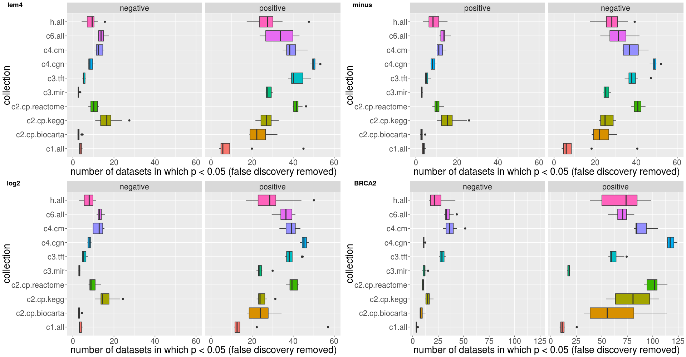
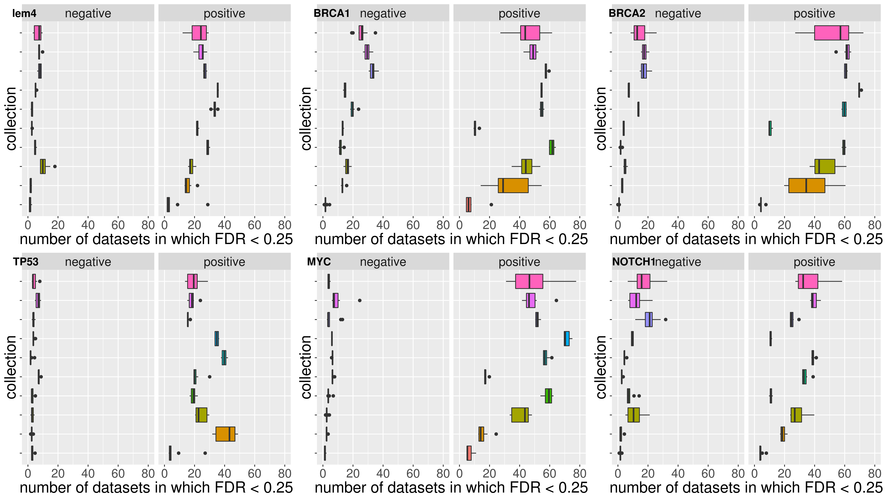

```r
library(tidyverse)
```


# 03/27

- investigate GSEA error:

  1. `none` is because chip is too small that coverage for every gene set isn't enough to run GSEA
  1. `Inf`: should be avoid by modifying `make_gsea_input()`
  1. `FAM110B`: GSE27442 is so slow that only contain _1_ sample

```bash
setdiff2 $known_error $total_error 
setdiff2 <(lem4 "grep -P '(none)|(\"-Inf\")|FAM110B' log/* | grep -oP 'log/[\w\.]+\w+'| sed 's/log\///'") <(lem4 "ls output/*/error* -d | grep -oP 'output/[\w\.]+/\w+' | sed 's/output\///' | sed 's/\/error//'")
```


# 03/29

We can extract platforms used in a GSE from it's webpage, but it's hard to know which is array when there are multiple platforms.

- export result of GSE dataset which has lem4 and can run GSEA to [breast_or_ovarian_cancer.tsv](output/breast_or_ovarian_cancer.tsv)

```r
read_rds('data/breast_cancer.rds') %>% 
    filter(str_detect(accession, 'GSE'), str_count(platform, 'GPL') == 1L) %>% 
	mutate('cancer' = ifelse(str_detect(title, '[Bb]reast'), 'breast', 'ovarian')) %>% 
	select(accession, cancer, sample, "title", "description") %>% 
	filter(accession %in% unique(gsea_output$accession)) %>% arrange(desc(sample))
```


# 03/30 explore why positive correlation is much more than negative

  1. negate lem4 is supposed to reverse the trend
  1. log2 expression preclude the possibility that the potential range the up-regulate and down-regulate is different

```r
# prepare input file
for (file in dir('gsea', 'GSE\\d+.cls', full = T)) {
    file %>% read_lines %>% 
        {.[4] = str_replace_all(.[4], '[\\d\\.]+', '-\\0') %>% str_remove_all('--'); .} %>% 
        write_lines(., str_replace(file, '.cls', '_minus.cls'))
}
mclapply(
    dir('gsea', 'GSE\\d+.txt', full = T), 
    function (file) {
        file %>% read_tsv %>% mutate(Description = 'NA') %>% 
            mutate_at(-1:-2, . %>% log2 %>% {ifelse(is.infinite(.) | is.nan(.), NA, .)}) %>% 
            write_tsv(., str_replace(file, '.txt', '_log2.txt'), na = '')
    }, mc.preschedule = F
) -> dev.null

gds_command <- . %>% paste0(
    'java -Xmx512m -cp /path/to/GSEA/gsea-3.0.jar xtools.gsea.Gsea', 
    ' -gmx /path/to/GSEA/msigdb_v6.1/msigdb_v6.1_GMTs/gene_set.v6.1.symbols.gmt', 
    ' -res gsea/', ., '.txt -cls gsea/', ., '.cls#ANKLE2 -chip gsea/', ., '.chip', 
    ' -out output/gene_set -collapse false -nperm 1000 -permute phenotype', 
    ' -rpt_label ', ., ' -metric Pearson -gui false &> log/gene_set_', ., ' &'
)

# generate command
gse_command <- . %>% paste0(
    'java -Xmx4000m -cp /path/to/GSEA/gsea-3.0.jar xtools.gsea.Gsea', 
    ' -gmx /path/to/GSEA/msigdb_v6.1/msigdb_v6.1_GMTs/gene_set.v6.1.symbols.gmt', 
    ' -res gsea/', ., '.txt -cls gsea/', ., '.cls#ANKLE2 -chip gsea/', ., '.chip', 
    ' -out output/gene_set -collapse true -nperm 1000 -permute phenotype', 
    ' -rpt_label ', ., ' -metric Pearson -gui false &> log/gene_set_', .
)
gene_sets <- c(
    'h.all', 'c1.all', 'c2.cp.biocarta', 'c2.cp.kegg', 'c2.cp.reactome', 
    'c3.mir', 'c3.tft', 'c4.cgn', 'c4.cm', 'c6.all', 'c5.all', 'c2.cgp', 'c7.all'
)
total_commands <- lapply(
    gene_sets, 
    . %>% str_replace_all(
        dir('gsea', 'GSE') %>% str_extract('GSE\\d+') %>% unique %>% gse_command, 
        'gene_set', .
    )
) %>% unlist

todo_commands <- c(
    total_commands %>% str_replace('\\.cls', '_minus.cls') %>% str_replace('output', 'output_minus'),
    total_commands %>% str_replace('\\.txt', '_log2.txt') %>% str_replace('output', 'output_log2') 
)

wait_line <- seq(24, length(todo_commands), 24);
todo_commands[wait_line] = str_replace(todo_commands[wait_line], '$', '\nwait')
write_lines(c('#!/bin/bash', todo_commands), 'temp.sh')
```

The code for following figure is lost, you may refer to the code below. Here we also include another gene for comparsion.




# 04/01 contrast positive vs negative correlation with other 5 genes

We select 5 genes, some oncogene, some anti-oncogene.

```r
sample_df <- read_rds('data/breast_cancer.rds') %>% filter(str_detect(accession, 'GSE')) %>%
    select(accession, n_sample = sample) %T>% print
#> # A tibble: 1,193 x 2
#>    accession n_sample
#>    <chr>        <int>
#>  1 GSE114359        6
#> ...

make_gsea_output <- function(rds_file) {
    rds_file %>% read_rds %>% 
        rename(gene_set = NAME, p = 'NOM p-val', FDR = 'FDR q-val') %>%
        select(collection, correlation, gene_set, p, FDR, accession) %>%
        inner_join(sample_df)
}

plot_summary <- . %>% group_by(collection, correlation, gene_set) %>% filter(n_sample > 100) %>% 
    summarise(N = n(), n = sum(FDR < 0.25) - sum(FDR*(FDR < 0.25))) %>%
    arrange(desc(n)) %>% slice(1:10) %>%
    {ggplot(., aes(x = collection, y = n, fill = collection)) +
        geom_boxplot(show.legend = F) + facet_wrap(~correlation) + coord_flip() +
        theme(text = element_text(size = 20), axis.text.y = element_blank()) + 
        ylab('number of datasets in which FDR < 0.25')
    }

gene_list <- list(
    make_gsea_output('data-raw/gsea_output_normal.rds') %>% plot_summary + ylim(0, 80),
    make_gsea_output('data-raw/gsea_output_BRCA1.rds')  %>% plot_summary + ylim(0, 80),
    make_gsea_output('data-raw/gsea_output_BRCA2.rds')  %>% plot_summary + ylim(0, 80),
    make_gsea_output('data-raw/gsea_output_TP53.rds')   %>% plot_summary + ylim(0, 80),
    make_gsea_output('data-raw/gsea_output_MYC.rds')    %>% plot_summary + ylim(0, 80),
    make_gsea_output('data-raw/gsea_output_NOTCH1.rds') %>% plot_summary + ylim(0, 80)
)

cowplot::plot_grid(
    plotlist = gene_list, nrow = 2, label_y = 0.98,
    labels = c('lem4', 'BRCA1', 'BRCA2', 'TP53', 'MYC', 'NOTCH1')
)
```


