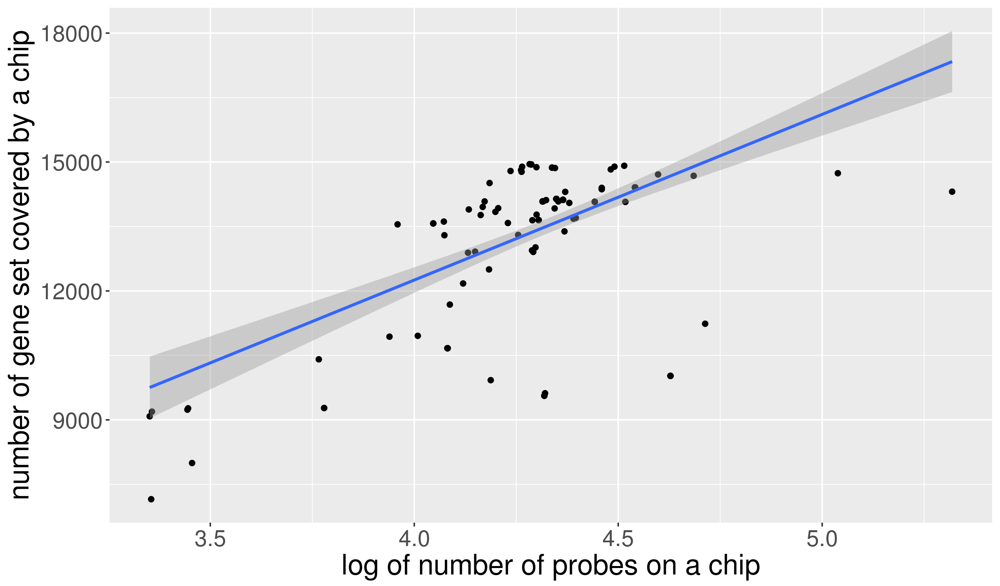
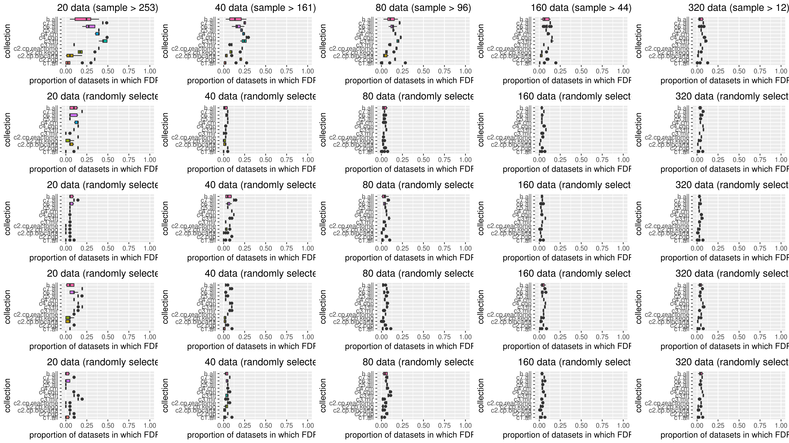

```r
library(tidyverse)
```


# 04/02 how sample size & probe number affect N & n

```bash
lem4 wc -l gsea/GSE*.txt | sed '$d' > data-raw/gse_probe.tab
wc -l /patn/to/msigdb_v6.1/msigdb_v6.1_GMTs/* | sed '$d' > data-raw/msigdb.gmt
```

```r
probe_df <- 'data-raw/gse_probe.tab' %>% read_lines %>% str_remove('^ +') %>% 
	paste0(collapse = '\n') %>% read_delim(' ', col_names = c('n_probe', 'accession')) %>%
    mutate_at(1, as.integer) %>% mutate_at(2, . %>% str_extract('GSE\\d+')) %T>% print
#> # A tibble: 1,171 x 2
#>    n_probe accession
#>      <int> <chr>    
#>  1   54676 GSE10046 
#> ...

ratio_vs_sample <- gsea_output %>% group_by(correlation, collection, accession) %>% 
	summarise(N = n(), n = sum(p < 0.05) - sum(FDR*(p < 0.05))) %>% 
	mutate(ratio = n/N) %>% left_join(gse_info) 
```


# 04/03 how n/N is effected

```r
ratio_vs_sample %>% group_by(accession) %>% 
    summarise(mean_ratio = mean(ratio)) %>% left_join(gse_info) %T>%
	{print(ggplot(., aes(x = sqrt(n_sample), y = mean_ratio)) + geom_point() + 
        geom_smooth(method = 'lm', formula = y~x))
    } %>% mutate(sqrt_n_sample = sqrt(n_sample)) %>% 
    lm(mean_ratio~sqrt_n_sample, .) %>% {summary(.)$r.squared}
```

```r
# collapse the x variable will significantly increase R^2
ratio_vs_sample %>% group_by(n_sample) %>% summarise(mean_ratio = mean(ratio)) %T>%
	{print(ggplot(., aes(x = sqrt(n_sample), y = mean_ratio)) + 
        geom_point() + geom_smooth(method = 'lm', formula = y~x) + 
        labs(x = 'log of number of samples on a chip') + 
        labs(y = 'mean of proportion of true positive gene set') + 
        theme(text = element_text(size = 20)))
    } %>% mutate(sqrt_n_sample = sqrt(n_sample)) %>% 
    lm(mean_ratio~sqrt_n_sample, .) %>% {summary(.)$r.squared}
```


```r
# the linear relationship is more obvious in positive subset
gsea_output %>% group_by(correlation, collection, accession) %>% 
	summarise(N = n(), n = sum(p < 0.05) - sum(FDR*(p < 0.05))) %>% 
left_join(gse_info) %>% mutate(ratio = n/N) %>% group_by(correlation, n_sample) %>% 
    summarise(mean_ratio = mean(ratio)) %>% group_by(correlation) %T>%
	{print(ggplot(., aes(x = sqrt(n_sample), y = mean_ratio, group = correlation)) + 
        geom_point() + geom_smooth(method = 'lm', formula = y~x) + facet_wrap(~correlation) + 
        labs(x = 'log of number of samples on a chip') + 
        labs(y = 'mean of proportion of true positive gene set') + 
        theme(text = element_text(size = 20)))
    } %T>% {filter(., correlation == 'positive') %>% mutate(sqrt_n_sample = sqrt(n_sample)) %>% 
    lm(mean_ratio~sqrt_n_sample, .) %>% {print(summary(.)$r.squared)}
    } %>% {filter(., correlation == 'negative') %>% mutate(sqrt_n_sample = sqrt(n_sample)) %>% lm(mean_ratio~sqrt_n_sample, .) %>% {print(summary(.)$r.squared)}}
```


```r
## probe number doesn't influence
gsea_output %>% group_by(correlation, collection, accession) %>% 
	summarise(N = n(), n = sum(p < 0.05) - sum(FDR*(p < 0.05))) %>% left_join(gse_info) %>%
	mutate(ratio = n/N) %>% group_by(n_probe) %>% summarise(mean_ratio = mean(ratio)) %T>%
	{print(ggplot(., aes(x = sqrt(n_probe), y = mean_ratio)) + 
        geom_point() + geom_smooth(method = 'lm', formula = y~x) + 
        labs(x = 'log of number of probes on a chip') + 
        labs(y = 'mean of proportion of true positive gene set') + 
        theme(text = element_text(size = 20)))
    } %>% mutate(sqrt_n_probe = sqrt(n_probe)) %>% 
    lm(mean_ratio~sqrt_n_probe, .) %>% {summary(.)$r.squared}
```


# 04/04 how N is effected

```r
gsea_output %>% group_by(accession) %>% 
	summarise(N = n()) %>% left_join(gse_info) %T>%
	{print(ggplot(., aes(x = log10(n_probe), y = N)) + 
        geom_point() + geom_smooth(method = 'lm', formula = y~x) + 
        labs(x = 'log of number of probes on a chip') + 
        labs(y = 'number of gene set covered by a chip') + 
        theme(text = element_text(size = 20)))
    } %>% mutate(log_n_probe = log(n_probe)) %>% 
    lm(N~log_n_probe, .) %>% {summary(.)$r.squared}
```



```r
## collapsing also increase R^2, but origin is already good and the plot hardly changes
gsea_output %>% group_by(accession) %>% 
	summarise(N = n()) %>% left_join(gse_info) %>% 
    group_by(n_probe) %>% summarise(mean_N = mean(N)) %T>%
	{print(ggplot(., aes(x = log10(n_probe), y = mean_N)) + 
        geom_point() + geom_smooth(method = 'lm', formula = y~x))
    } %>% mutate(log_n_probe = log(n_probe)) %>% 
    lm(mean_N~log_n_probe, .) %>% {summary(.)$r.squared}

## sample number doesn't influence
gsea_output %>% group_by(accession) %>% 
	summarise(N = n()) %>% left_join(gse_info) %T>%
	{print(ggplot(., aes(x = log10(n_sample), y = N)) + 
        geom_point() + geom_smooth(method = 'lm', formula = y~x) + 
        labs(x = 'log of number of samples on a chip') + 
        labs(y = 'number of gene set covered by a chip') + 
        theme(text = element_text(size = 20)))
    } %>% mutate(log_n_sample = log(n_sample)) %>% 
    lm(N~log_n_sample, .) %>% {summary(.)$r.squared}
```


# 04/05 N, n, ratio

```r
gsea_summary <- gsea_output_normal %>% 
    group_by(collection, correlation, gene_set) %>% filter(n_sample > 50) %>% 
    summarise(N = n(), n = sum(FDR < 0.25) - sum(FDR*(FDR < 0.25)), ratio = n/N)

cowplot::plot_grid(    
    gsea_summary %>% ggplot(aes(x = collection, y = N)) + 
        geom_boxplot() + facet_wrap(~correlation) + coord_flip() + 
        ylab('number of datasets a certain gene set is investigated in'),

    gsea_summary %>% arrange(desc(ratio)) %>% slice(1:10) %>% 
	    ggplot(aes(x = collection, y = ratio, fill = collection)) + 
		    geom_boxplot(show.legend = F) + facet_wrap(~correlation) + coord_flip() ,

    gsea_summary %>% arrange(desc(n)) %>% slice(1:10) %>%
        ggplot(., aes(x = collection, y = n, fill = collection)) +
            geom_boxplot(show.legend = F) + facet_wrap(~correlation) + coord_flip() +
            ylab('number of datasets in which p < 0.05 (false discovery removed)') + 
            theme(text = element_text(size = 20)),
    
    nrow = 2
)
```


# 04/06 how n correlate with sample

```r
n_sample_df <- gsea_output_full %>% filter(!duplicated(accession)) %>% select(accession, n_sample)

n_sample_df %>% 
    ggplot(aes(n_sample)) + 
        geom_histogram(binwidth = 10) + scale_x_continuous(breaks = seq(0,1000,100))
n_sample_df %>% filter(., n_sample > 10) %>% 
    ggplot(aes(n_sample)) + 
        geom_density(adjust = 0.2) + scale_x_continuous(breaks = seq(0,1000,50))
n_sample_df %>% filter(., n_sample > 30) %>% 
    ggplot(aes(n_sample)) + 
        geom_density(adjust = 0.2) + scale_x_continuous(breaks = seq(0,1000,50)) + 
        geom_vline(xintercept = 230, color = 'blue') + 
        geom_vline(xintercept = 134, color = 'red') + 
        geom_vline(xintercept = 85, color = 'green')
```

```r
compare_select_sample <- function(n_data, random = F, FDR_lower = 0.25) {
	if (random) {
		accessions <- n_sample_df %>% arrange(desc(n_sample)) %>% sample_n(n_data) %>% {.$accession}
		title <- paste0(n_data, ' data (randomly selected)')
	} else {
		accessions <- n_sample_df %>% arrange(desc(n_sample)) %>% slice(1:n_data) %>% {.$accession}
		min_sample <- n_sample_df %>% arrange(desc(n_sample)) %>% slice(n_data) %>% {.$n_sample}
		title <- paste0(n_data, ' data (sample > ', min_sample, ')')
	}
	
	gsea_output_full %>% filter(n_sample > 6L) %>% filter(accession %in% accessions) %>% 
		filter(correlation == 'positive') %>% group_by(collection, gene_set) %>%
	    summarise(N = n(), n = sum(FDR < FDR_lower) - sum(FDR*(FDR < FDR_lower))) %>%
	    arrange(desc(n)) %>% slice(1:10) %>%
	        ggplot(aes(x = collection, y = n/n_data, fill = collection)) +
	        geom_boxplot(show.legend = F) + ylim(0, 1) + coord_flip() +
	        theme(text = element_text(size = 12), plot.title = element_text(hjust = 0.5)) + 
            labs(title = title, y = paste0('proportion of datasets in which FDR < ', FDR_lower))
}
```

```r
lapply(seq(20, 500, 20), compare_select_sample) %>% 
    cowplot::plot_grid(plotlist = .) 
```


```r
c(
	lapply(c(20, 40, 80, 160, 320), compare_select_sample),
	replicate(4, lapply(c(20, 40, 80, 160, 320), compare_select_sample, T))
) %>% cowplot::plot_grid(plotlist = .) 
```


```r
plotlist = lapply(seq(20, 500, 20), compare_select_sample, FDR_lower = 0.1) %>%
    cowplot::plot_grid(plotlist = .) 
```


```r
c(
	lapply(c(20, 40, 80, 160, 320), compare_select_sample, FDR_lower = 0.1),
	replicate(4, lapply(c(20, 40, 80, 160, 320), compare_select_sample, T, FDR_lower = 0.1))
) %>% cowplot::plot_grid(plotlist = .) 
```
    


```r
plotlist = lapply(seq(20, 500, 20), compare_select_sample, FDR_lower = 0.05) %>%
    cowplot::plot_grid(plotlist = .) 
```
    


```r
c(
	lapply(c(20, 40, 80, 160, 320), compare_select_sample, FDR_lower = 0.05),
	replicate(4, lapply(c(20, 40, 80, 160, 320), compare_select_sample, T, FDR_lower = 0.05))
) %>% cowplot::plot_grid(plotlist = .) %>% 
```
    


It's selecting dataset with biggest sample rather than a subset of data that increase ratio
