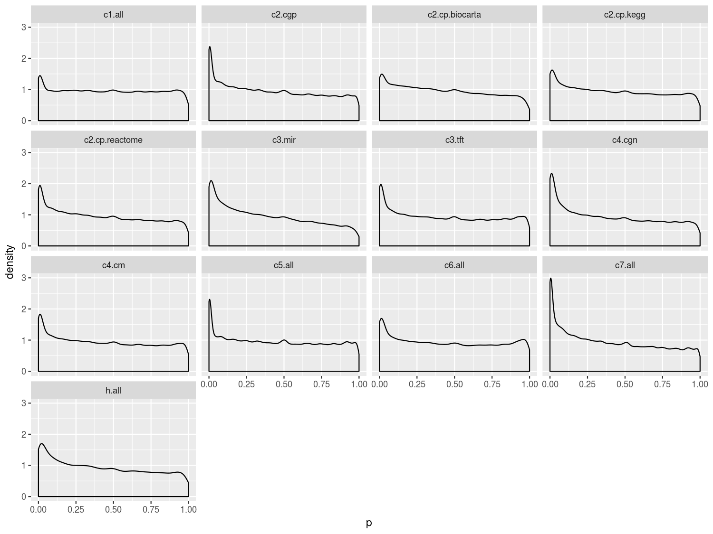
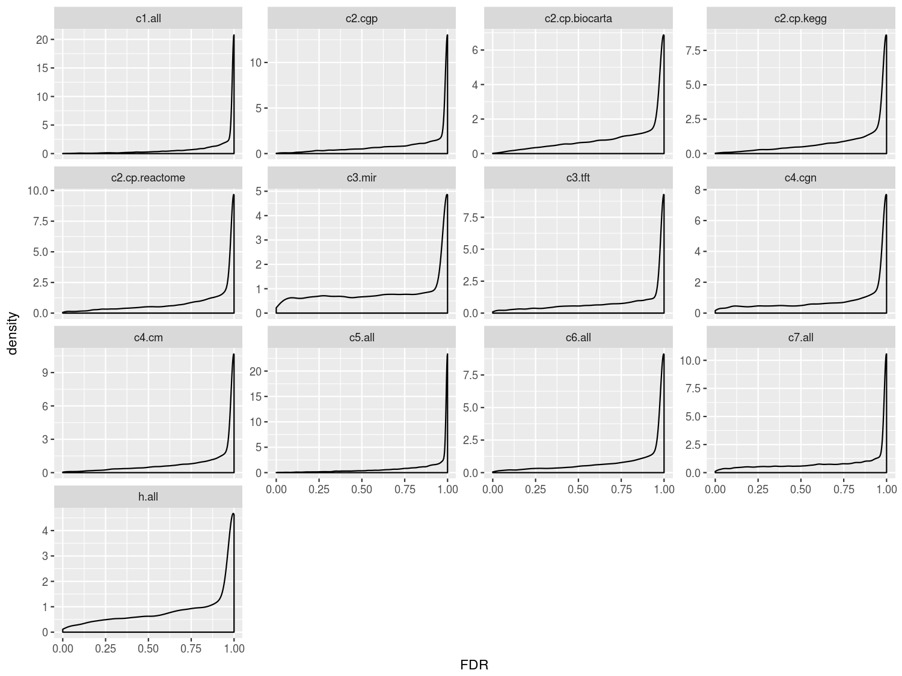
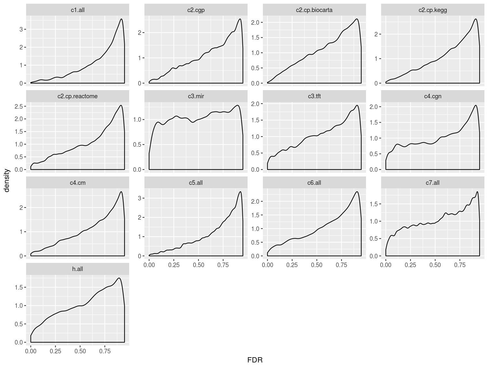

```r
library(tidyverse)
```


# 04/07 GSEA output verify and judgement

1. There is no overlap between breast and ovary.

1. In a certain dataset, the correlation with lem4 for any given gene set is either positive or negative

1. There is a bias in the coverage of gene set in datasets.

1. Even you use ratio, there is still more positive. And you can see some extreme point, like `4/5`, which should be avoided

1. I prefer to use `n` instead of `n/N`. Keep in mind that in this situation, the status of many gene set should be 'unknown' instead of 'not important' (maybe you can consider `n^2/N`).


# 04/12 case study on RNA-seq data

I use two RNA-seq dataset (both have a copy in GEO, I'm curious what it looks like):

1. PRJNA128733 (GSE22260)  
   used in SeqGSEA, 20 cancer + 10 normal
1. PRJNA432903 (GSE110114) 
   search 'breast' in https://www.ncbi.nlm.nih.gov/bioproject/, filter "Transcriptome, SRA, Human"

- download raw data.

```r
read_tsv('data-raw/PRJNA432903.txt')$fastq_ftp %>% str_split(';') %>% unlist %>% paste0('ftp://', .)
```

- assembly with stringtie

```r
hisat_command <- 'hisat2 -p 24 --dta -x RNA-seq/grch38/genome -1 raw/fastq/SRR6671104_1.fastq.gz -2 raw/fastq/SRR6671104_2.fastq.gz -S RNA-seq/SRR6671104.sam; samtools sort -@ 24 -o RNA-seq/SRR6671104.bam RNA-seq/SRR6671104.sam; rm RNA-seq/SRR6671104.sam; '
formatC(4:16, width = 2, flag = '0') %>% paste0('SRR66711', .) %>% 
    sapply(. %>% stringr::str_replace_all(hisat_command, 'SRR6671104', .)) %>% 
    paste0(collapse = '') %>% paste0('nohup bash -c "', ., '" &> /dev/null &') %>% 
    write_lines('temp.sh')

stringtie_command <- 'stringtie -p 24 -G RNA-seq/Homo_sapiens.GRCh38.84.gtf -o RNA-seq/SRR6671104.gtf -l SRR6671104 RNA-seq/SRR6671104.bam'
formatC(4:16, width = 2, flag = '0') %>% paste0('SRR66711', .) %>% 
    sapply(. %>% stringr::str_replace_all(stringtie_command, 'SRR6671104', .)) %>% 
    paste0(collapse = '; ')  %>% paste0('nohup bash -c "', ., '" &> /dev/null &') %>% 
    write_lines('temp.sh')

stringtie_command2 <- 'stringtie -e -B -p 24 -G RNA-seq/merged.gtf -o RNA-seq/SRR6671104-ballgown.gtf -l SRR6671104 RNA-seq/SRR6671104.bam'
formatC(4:16, width = 2, flag = '0') %>% paste0('SRR66711', .) %>% 
    sapply(. %>% stringr::str_replace_all(stringtie_command2, 'SRR6671104', .)) %>% 
    paste0(collapse = '; ') %>% paste0('nohup bash -c "', ., '" &> /dev/null &') %>% 
    write_lines('temp.sh')
```

```bash
ls RNA-seq/SRR*.gtf > RNA-seq/mergelist.txt
stringtie --merge -p 24 -G RNA-seq/Homo_sapiens.GRCh38.84.gtf -o RNA-seq/merged.gtf RNA-seq/mergelist.txt
```


# 04/15 coverage of platform

```r
breast_cancer <- read_rds('data/breast_cancer.rds')
breast_cancer$platform %>% str_extract('GPL\\d+') %>% setdiff(names(rGEO.data::gpl_metas))
#> character(0)
breast_cancer$platform %>% str_extract('GPL\\d+') %>% mclapply(lem4:::guess_platform_type_old) ->x

y <- breast_cancer$platform %>% str_extract('GPL\\d+') %>% 
    lapply(. %>% rGEO:::fake_platform(rGEO.data::gpl_metas)) %>% 
    parallel::mclapply(rGEO:::guess_platform_type, mc.preschedule = F) %T>% print
#> ...
#> [[1332]]
#> [[1332]]$measure
#> [1] "GB_ACC"
#> 
#> [[1332]]$sep_pattern
#> [1] "[^\\w\\.]+"
#> 
#> [[1332]]$as_symbol_from
#> [1] "genbank"

sapply(x, is.null) %>% sum
sapply(y, is.null) %>% sum
#> [1] 19

breast_cancer$platform %>% str_extract('GPL\\d+') %>% {.[sapply(y, class) == 'NULL']}
#>  [1] "GPL10379" "GPL16956" "GPL16956" "GPL16956" "GPL19251" "GPL21962"
#>  [7] "GPL10379" "GPL8179"  "GPL10379" "GPL20321" "GPL19915" "GPL15640"
#> [13] "GPL10379" "GPL9793"  "GPL10379" "GPL10379" "GPL9965"  "GPL4035" 
#> [19] "GPL2586"
```

|                           |                                 |
|---------------------------|---------------------------------|
| guess_platform_type_old() | 32 NULL                         |
| guess_platform_type()     | 19 NULL                         |
| read data                | 74 (maybe some column is empty) |


# 04/16 download additional GSE raw data

```r
gse_ftp <- read_rds('data/breast_cancer.rds')$accession %>% 
    str_subset('GSE') %>% c('GSE16446', 'GSE17705') %>% 
    {c(rGEO::gse_matrix_ftp(.), rGEO::gse_soft_ftp(.))} %T>% print
#> [1] "ftp://ftp.ncbi.nlm.nih.gov/geo/series/GSE114nnn/GSE114359/matrix/GSE114359_series_matrix.txt.gz"
#> [2390] "ftp://ftp.ncbi.nlm.nih.gov/geo/series/GSE17nnn/GSE17705/soft/GSE17705_family.soft.gz" 

write_lines(gse_ftp, 'workstation/GSE.md')
```

then copy `GSE.md` to workstation and download items which don't exist

```r
read_lines('GSE.md') %>% {.[!(basename(.) %in% dir('raw/GSE'))]} %>% 
    paste0('wget -P raw/GSE -c ', .) %>% parallel::mclapply(system)
```


# 04/24 leading edge analysis

```r
read_leading_edge <- function(path) {
	gene_set <- dir(path, '\\.xls', full = T) %>% str_subset('gsea_report') %>% 
        lapply(. %>% read_tsv(T, 'c------d----')) %>% bind_rows %>% 
        filter(`FDR q-val` < 0.25) %>% {.$NAME}
    
    if(length(gene_set) == 0) return(NULL)
    # maybe two files both not exist
    
    lapply(
        paste0(path, '/', gene_set, '.xls') %>% {.[file.exists(.)]}, 
        . %>% {
            tibble::add_column(readr::read_tsv(., T, '-c---d-c-'), gene_set = basename(.))
        }
    ) %>% dplyr::bind_rows() %>% filter(`CORE ENRICHMENT` == 'Yes')
}

dir('output', full = T) %>% dir(full = T) %>% str_subset('GSE93601') %>% {.[1]} %>% read_leading_edge
read_leading_edge('/path/to/qGSEA/tests/testthat/output/GSE19161.Gsea.1523948718159')
```

```r
output_dirs <- dir('output', full = T) %>% dir(full = T) %>% 
    str_subset('/GSE') %>% {.[str_extract(., 'GSE\\d+') %in% big_accession]}

leading_edge_l <- parallel::mclapply(output_dirs, read_leading_edge, mc.preschedule = F)
empty <- sapply(leading_edge_l, length) == 0L

leading_edge <- parallel::mcmapply(
    function(df, output_dir) {
        df %>% mutate(
            gene_set = stringr::str_remove(gene_set, '.xls'),
            collection = stringr::str_extract(output_dir, '(?<=/)[\\w\\.]+'), 
            accession = stringr::str_extract(output_dir, 'GSE\\d+')
        ) %>% select(-`CORE ENRICHMENT`)
    },
    leading_edge_l[!empty], output_dirs[!empty],
    SIMPLIFY = F
) %>% bind_rows %T>% print
#> # A tibble: 777,934 x 5
#>    PROBE    `RANK METRIC SCORE` gene_set collection accession
#>    <chr>                  <dbl> <chr>    <chr>      <chr>    
#>  1 ANKLE2                 1     CHR12Q24 c1.all     GSE102484
#>  2 POLE                   0.528 CHR12Q24 c1.all     GSE102484
#> ...
```

then save to [leading_edge.rds](../data/leading_edge.rds)


# 04/27 distribution of p & FDR

```r
gsea_output_full %>% select(collection, accession, p, FDR) %>% 
    ggplot(aes(x = p)) + geom_density() + 
    xlim(0, 1) + facet_wrap(~collection, scales = 'free_y') + 
    theme(plot.title = element_text(hjust = 0.5))
```



```r

gsea_output_full %>% select(collection, accession, p, FDR) %>% 
    ggplot(aes(x = FDR)) + geom_density() + 
    xlim(0, 1) + facet_wrap(~collection, scales = 'free_y') + 
    theme(plot.title = element_text(hjust = 0.5))
```



```r
gsea_output_full %>% select(collection, accession, p, FDR) %>% 
    ggplot(aes(x = FDR)) + geom_density() + 
    xlim(0, 0.95) + facet_wrap(~collection, scales = 'free_y') + 
    theme(plot.title = element_text(hjust = 0.5))
```


